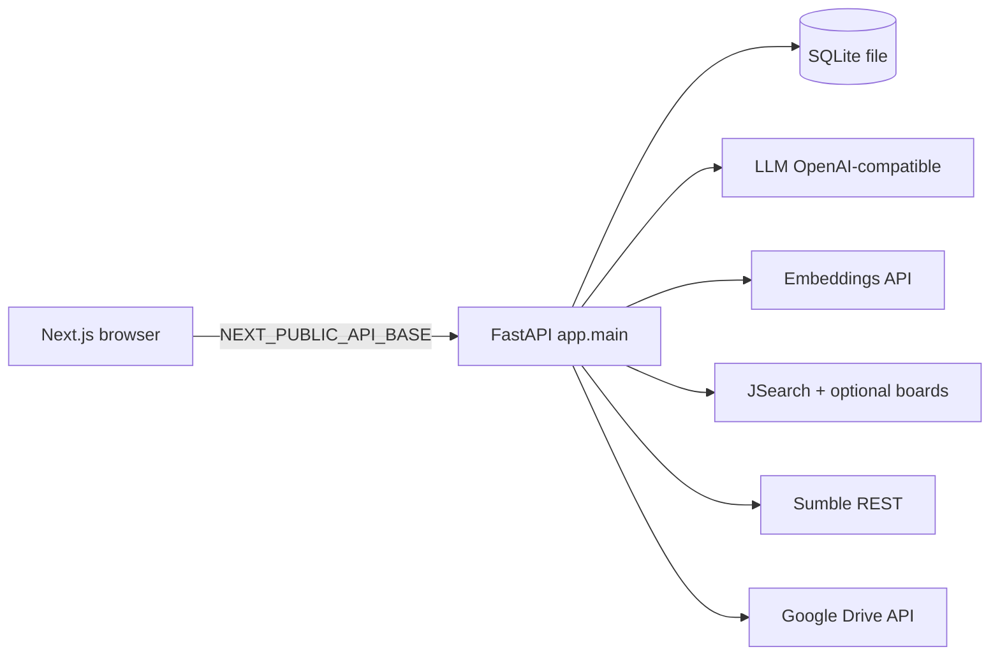

# TeamScout Architecture

One-page engineer notes. Claims match the code under `backend/app`.

## System diagram



Single process API + single Next frontend. No message bus, no remote vector DB, no multi-service mesh.

**Deploy topology (public):** Browser → Vercel (Next.js) → Fly.io (FastAPI :8000) with SQLite + uploads on volume `/data`. Optional Litestream → S3-compatible bucket. Details: `DEPLOYMENT.md`.

## Request path (Feature 1)

```text
Upload PDF/DOCX
  → parser (LLM complete_json, prompt resume_schema)
  → confirm profile fields
  → multi-source job fetch (JSearch multi-query + optional Remotive/Arbeitnow)
  → dense + BM25 → RRF → LLM rerank (batched) → weighted fuse
  → top SEARCH_RESULTS_TOP_N (default 10) with score_breakdown
  → team extract (prompt team_extract) → Sumble find → email reveal
```

Feature 2 inverts ranking: library resumes are candidates; JD is the query (`resume_ranking`).

## Retrieve → rank funnel

**Jobs (resume search / intent search)** — `app.services.jobs` + `job_boards` + `ranking` + `hybrid_rank` + `ranking_math`:

1. **Retrieve:** Multi-query JSearch (`build_jsearch_queries`) up to `JOBS_FETCH_TARGET` (default 150). When `JOBS_EXTRA_SOURCES_ENABLED` (default true), merge optional free boards (Remotive, Arbeitnow) via `job_boards.fetch_optional_boards` — board failures log and continue. Filter by `JOBS_RECENCY_DAYS` (default 14), require apply URL, dedupe, cache in SQLite `jobs_cache` with stable `job_id`.
2. **Dense rank:** embed query + candidates (`embeddings`), cosine similarity order. Content-hash cache in `embedding_cache`.
3. **Lexical rank:** BM25 over tokenized title/skills/description (`rank_bm25`).
4. **RRF merge:** for 0-based index `i` in each ranking, add `1 / (RRF_K + i + 1)`; `RRF_K` default 60; then min-max normalize → `rrf_normalized` ∈ [0,1].
5. **LLM rerank** on top `RERANK_TOP_N` (default 30): batched (`_RERANK_BATCH_SIZE = 8` in `ranking.py`) so JSON responses stay complete; `complete_json` salvages truncated `results` arrays when needed (`llm._salvage_results_json`). Versioned prompt `rerank` (YOE / must-haves / over-under qualification).
6. **Fuse** (`fuse_final_score`), returned as 0–100. Defaults from `RANKING_WEIGHT_*` in `app/core/config.py` (must sum to ~1.0 via `validate_ranking_weights` at startup):

```
final = 100 * (
  RANKING_WEIGHT_LLM          * (llm_fit / 100)   # default 0.38
+ RANKING_WEIGHT_RRF          * rrf_normalized    # default 0.20
+ RANKING_WEIGHT_SKILLS       * skill_jaccard     # default 0.12
+ RANKING_WEIGHT_EXPERIENCE   * experience_fit    # default 0.12
+ RANKING_WEIGHT_REQUIREMENTS * requirements_met  # default 0.10
+ RANKING_WEIGHT_RECENCY      * recency_half_life # default 0.08
)
```

Top `SEARCH_RESULTS_TOP_N` (default 10) returned with transparent `score_breakdown`.

**Resume pick** — job description is the query; library resumes are candidates (`resume_ranking`). Recency is zeroed; experience + requirements still apply.

## Lightweight ML ops (what we mean)

Not Kubernetes, MLflow-as-product, feature stores, or model registries. In this repo:

| Piece | Where |
|---|---|
| Versioned prompts | `backend/app/prompts/*.md` (YAML frontmatter name/version) |
| Traces | SQLite `traces` via `observability`; optional OTLP |
| Embedding cache | SQLite `embedding_cache` |
| Cost ceilings | `LLM_DAILY_COST_CEILING_USD`, `SUMBLE_DAILY_CREDIT_CEILING` → 429 fail-closed |
| Eval floors | `evals/thresholds.json` (enforced by scripts + `check_scope`) |
| Eval history | `evals/history.jsonl` (append from eval scripts) |
| Trend report | `scripts/eval_report.py` / `make eval-report` |
| Offline fit suite | `scripts/eval_fit_signals.py` / `make eval-fit` |
| Hybrid ranking eval | `scripts/eval_ranking.py` / `make eval` |
| Resume-pick eval | `scripts/eval_resume_pick.py` |
| Pipeline gate | `scripts/pipeline_check.py` / `make pipeline` |
| Ops UI | `GET /ops`, `GET /ops/json` behind `OPS_TOKEN` |

## Credit-safety (Sumble)

- `sumble_client.post(..., credit_costing=True)` logs redacted URL at INFO before the call and credits used/remaining after.
- Email reveal: SQLite `email_reveals` rows; confirm path uses a transaction so a successful reveal is not double-charged on retry (`email_reveal`).
- Unconfigured Sumble raises `ServiceNotConfiguredError` (503 JSON) — no invented contacts.

## Error-handling philosophy

- Fail loud: missing LLM / embeddings / jobs / Sumble config → typed `ServiceNotConfiguredError`; HTTP failures → `ServiceFailingError`.
- No silent fallbacks or mock data importable from `backend/app`.
- Global handler (`exception_handlers.unhandled_exception_handler`) returns generic `internal_error` to clients; full exception logged server-side with `request_id`.
- Rate limits (slowapi) and 10 MiB upload cap return structured JSON errors without stack traces.

## Why SQLite at this scale

- One operator, one deploy, file-backed state for resumes, job cache, contacts, email reveals, traces, embedding cache.
- No ops tax of a separate database service; Fly volume mounts `/data` for persistence.
- Ranking and enrichment are request-scoped HTTP + in-process math — not a multi-writer analytics warehouse.

## Observability

- **Traces:** every LLM, embeddings, Sumble, and JSearch outbound call is instrumented via `app.services.observability` into SQLite `traces` (request_id from contextvars, operation, model, prompt name/version/hash, tokens, latency_ms, cost_usd, credits_used, status, error_type, cache_hit). **Trace writes are best-effort** (SQLite write failure is logged and does not fail the user request); **ceiling checks fail closed** on read/sum errors. Optional OTLP/HTTP JSON export when `OTEL_EXPORTER_OTLP_ENDPOINT` is set (best-effort; SQLite works with zero extra infra).
- **Ops dashboard:** `GET /ops` (HTML) and `GET /ops/json` behind `OPS_TOKEN`. Prefer `Authorization: Bearer` or `X-Ops-Token` (query `?token=` is local-dev only — can leak via logs/history/Referer). Missing `OPS_TOKEN` or wrong/missing token → 401 (not bypassable). Numbers tables only (no charting library): last 100 traces, p50/p95 latency, cost today, cost per feature-1/2 run, error rates, embedding cache hit-rate, ceilings.
- **Prompt registry:** versioned Markdown under `backend/app/prompts/*.md` with YAML frontmatter (`name`, `version`, optional `system` / `max_tokens`). Loader returns body + content hash; LLM traces store prompt metadata.
- **Embedding cache:** SQLite `embedding_cache` keyed by sha256(model + text); `embed` / `embed_batch` check cache first.
- **Cost guardrails:** daily LLM USD ceiling (`LLM_DAILY_COST_CEILING_USD`, default $5) and Sumble credit ceiling (`SUMBLE_DAILY_CREDIT_CEILING`) fail closed with `CostCeilingExceededError` (HTTP 429). Ceiling-check DB failures also deny.
- **Eval history:** `scripts/eval_ranking.py`, `scripts/eval_resume_pick.py`, and `scripts/eval_fit_signals.py` append metrics (+ prompt versions / model / git SHA where applicable) to `evals/history.jsonl`. `scripts/eval_report.py` prints trends. CI always runs the offline fit-signal suite and always attempts to upload `evals/history.jsonl` as an artifact (`if-no-files-found: ignore`); ranking/resume-pick history lines appear only when embeddings secrets are configured.
- **Prompt / model changes:** any change to prompts under `backend/app/prompts/` or to `LLM_MODEL` / `EMBEDDINGS_MODEL` requires a green eval run (ranking + resume-pick floors) before merge when secrets are available; floors remain enforced by `check_scope` / `evals/thresholds.json`.

### SQLite product tables (observability subset)

| Table | Purpose | Key columns |
|---|---|---|
| `traces` | Outbound call telemetry | `id`, `request_id`, `operation`, `model`, `prompt_name`, `prompt_version`, `prompt_hash`, `input_tokens`, `output_tokens`, `latency_ms`, `cost_usd`, `credits_used`, `status`, `error_type`, `cache_hit`, `created_at` |
| `embedding_cache` | Cached embedding vectors | `id`, `content_hash` (unique), `model`, `embedding_json`, `created_at` |

Other product tables (`resumes`, `jobs_cache`, `searches`, `contacts`, `email_reveals`, library tables, etc.) are defined in `backend/app/db/models.py` — see model source for the full column set; do not invent columns here.

## Production surface

| Concern | Implementation |
|---|---|
| Request ID | `RequestIdMiddleware` → `X-Request-ID` + structlog contextvars |
| Logging | JSON when `ENV=prod` (or non-TTY); console pretty in local TTY dev |
| Rate limits | slowapi on upload / search / find-team / reveal-email / extract-team / recommend-resumes (keyed on direct peer IP — compose/single-host; do not trust X-Forwarded-For without a known proxy hop) |
| CORS | `ALLOWED_ORIGINS` or `CORS_ORIGINS`; wildcard rejected in prod |
| Timeouts | `http_timeouts` used by llm, embeddings, jobs, sumble_client, drive |
| Health | config-presence checks + `version` (`APP_VERSION` / `GIT_SHA`); `/livez` process liveness |
| Traces / ops | SQLite `traces` + token-gated `/ops`; optional OTLP |
| Cost ceilings | LLM daily USD + Sumble daily credits → 429 fail closed |
| Pipeline gate | `make pipeline` → `scripts/pipeline_check.py` |
| Deploy | local: `Dockerfile.backend` / `Dockerfile.frontend` / `docker-compose.yml`; public: `fly.toml` + Vercel (`DEPLOYMENT.md`); wrappers: `make deploy-api` / `make deploy-web` / `make deploy-status` |

### Rate-limit keying

Limits use `slowapi.util.get_remote_address` (direct TCP peer). Correct for compose-direct and single-host deploy. Behind a reverse proxy without PROXY protocol, all clients share one IP — introduce a trusted-hop key function only when the proxy is known; never blindly trust client-supplied `X-Forwarded-For`.

## What we deliberately rejected

Platform sprawl (cluster orchestration, IaC-as-product, feature stores, remote model registries, queues, A/B SDKs) does not earn its place for a two-feature recruiting tool. Production-grade here means reproducible builds, CI gates, observable credit calls, eval floors, secure defaults, and one live deploy (Fly + Vercel).
