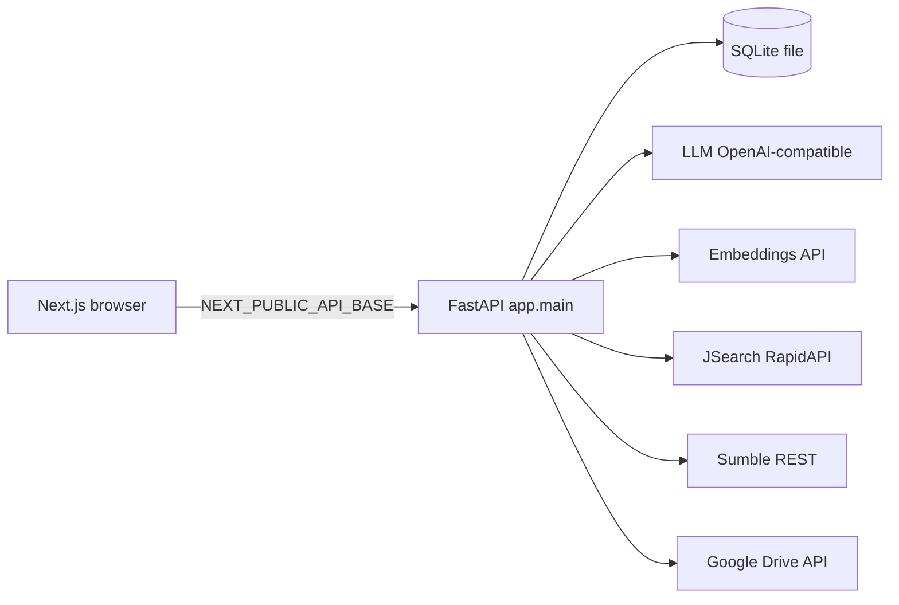

# TeamScout Architecture

One-page engineer notes. Claims match the code under `backend/app` as of M8.

## System diagram



Single process API + single Next frontend. No message bus, no remote vector DB, no multi-service mesh.

## Retrieve → rank funnel

**Jobs (resume search / intent search)** — `app.services.jobs` + `ranking` + `hybrid_rank` + `ranking_math`:

1. Fetch up to `JOBS_FETCH_TARGET` (default 150) from JSearch; filter by `JOBS_RECENCY_DAYS` (default 14); cache rows in SQLite `jobs_cache`.
2. Dense rank: embed query + candidates (`embeddings`), cosine similarity order.
3. Lexical rank: BM25 over tokenized text (`rank_bm25`).
4. RRF merge: for 0-based index `i` in each ranking, add `1 / (RRF_K + i + 1)` (equivalent to classic RRF with 1-based rank); `RRF_K` default 60; then min-max normalize.
5. Optional LLM rerank on top `RERANK_TOP_N` (default 30).
6. Final score (`fuse_final_score`), returned as 0–100:

```
final = 100 * (
  RANKING_WEIGHT_LLM     * (llm_fit / 100)   # default 0.5
+ RANKING_WEIGHT_RRF     * rrf_normalized      # default 0.3
+ RANKING_WEIGHT_SKILLS  * skill_jaccard       # default 0.1
+ RANKING_WEIGHT_RECENCY * recency_half_life   # default 0.1
)
```

Weights must sum to ~1.0 (`validate_ranking_weights` at startup). Top `SEARCH_RESULTS_TOP_N` (default 10) returned.

**Resume pick** — inverts the pipeline: job description is the query; library resumes are candidates (`resume_ranking`).

## Credit-safety (Sumble)

- `sumble_client.post(..., credit_costing=True)` logs redacted URL at INFO before the call and credits used/remaining after.
- Email reveal: SQLite `email_reveals` rows; confirm path uses a transaction so a successful reveal is not double-charged on retry (`email_reveal`).
- Unconfigured Sumble raises `ServiceNotConfiguredError` (503 JSON) — no invented contacts.

## Error-handling philosophy

- Fail loud: missing LLM / embeddings / jobs / Sumble config → typed `ServiceNotConfiguredError`; HTTP failures → `ServiceFailingError`.
- No silent fallbacks or mock data importable from `backend/app`.
- Global handler (`exception_handlers.unhandled_exception_handler`) returns generic `internal_error` to clients; full exception logged server-side with `request_id`.
- Rate limits (slowapi) and 10 MiB upload cap return structured JSON errors without stack traces.

## Why SQLite at this scale

- One operator, one deploy, file-backed state for resumes, job cache, contacts, email reveals.
- No ops tax of a separate database service; named Docker volume mounts the DB file for persistence.
- Ranking and enrichment are request-scoped HTTP + in-process math — not a multi-writer analytics warehouse.

## Observability (M8)

- **Traces:** every LLM, embeddings, Sumble, and JSearch outbound call is instrumented via `app.services.observability` into SQLite `traces` (request_id from contextvars, operation, model, prompt name/version/hash, tokens, latency_ms, cost_usd, credits_used, status, error_type, cache_hit). **Trace writes are best-effort** (SQLite write failure is logged and does not fail the user request); **ceiling checks fail closed** on read/sum errors. Optional OTLP/HTTP JSON export when `OTEL_EXPORTER_OTLP_ENDPOINT` is set (best-effort; SQLite works with zero extra infra).
- **Ops dashboard:** `GET /ops` (HTML) and `GET /ops/json` behind `OPS_TOKEN`. Prefer `Authorization: Bearer` or `X-Ops-Token` (query `?token=` is local-dev only — can leak via logs/history/Referer). Missing `OPS_TOKEN` or wrong/missing token → 401 (not bypassable). Numbers tables only (no charting library): last 100 traces, p50/p95 latency, cost today, cost per feature-1/2 run, error rates, embedding cache hit-rate, ceilings.
- **Prompt registry:** versioned Markdown under `backend/app/prompts/*.md` with YAML frontmatter (`name`, `version`, optional `system` / `max_tokens`). Loader returns body + content hash; LLM traces store prompt metadata.
- **Embedding cache:** SQLite `embedding_cache` keyed by sha256(model + text); `embed` / `embed_batch` check cache first.
- **Cost guardrails:** daily LLM USD ceiling (`LLM_DAILY_COST_CEILING_USD`, default $5) and Sumble credit ceiling (`SUMBLE_DAILY_CREDIT_CEILING`) fail closed with `CostCeilingExceededError` (HTTP 429). Ceiling-check DB failures also deny.
- **Eval history:** `scripts/eval_ranking.py` and `scripts/eval_resume_pick.py` append metrics + prompt versions + model + git SHA to `evals/history.jsonl`. `scripts/eval_report.py` prints trends. CI eval job uploads `evals/history.jsonl` as an artifact when secrets are present.
- **Prompt / model changes:** any change to prompts under `backend/app/prompts/` or to `LLM_MODEL` / `EMBEDDINGS_MODEL` requires a green eval run (ranking + resume-pick floors) before merge when secrets are available; floors remain enforced by `check_scope` / `evals/thresholds.json`.

### SQLite tables added in M8

| Table | Purpose | Key columns |
|---|---|---|
| `traces` | Outbound call telemetry | `id`, `request_id`, `operation`, `model`, `prompt_name`, `prompt_version`, `prompt_hash`, `input_tokens`, `output_tokens`, `latency_ms`, `cost_usd`, `credits_used`, `status`, `error_type`, `cache_hit`, `created_at` |
| `embedding_cache` | Cached embedding vectors | `id`, `content_hash` (unique), `model`, `embedding_json`, `created_at` |

## Production surface (M8)

| Concern | Implementation |
|---|---|
| Request ID | `RequestIdMiddleware` → `X-Request-ID` + structlog contextvars |
| Logging | JSON when `ENV=prod` (or non-TTY); console pretty in local TTY dev |
| Rate limits | slowapi on upload / search / find-team / reveal-email / extract-team / recommend-resumes (keyed on direct peer IP — compose/single-host; do not trust X-Forwarded-For without a known proxy hop) |
| CORS | `ALLOWED_ORIGINS` or `CORS_ORIGINS`; wildcard rejected in prod |
| Timeouts | `http_timeouts` used by llm, embeddings, jobs, sumble_client, drive |
| Health | config-presence checks + `version` (`APP_VERSION` / `GIT_SHA`) |
| Traces / ops | SQLite `traces` + token-gated `/ops`; optional OTLP |
| Cost ceilings | LLM daily USD + Sumble daily credits → 429 fail closed |
| Deploy | local: `Dockerfile.backend` / `Dockerfile.frontend` / `docker-compose.yml`; public: `fly.toml` + Vercel (`DEPLOYMENT.md`) |

### Rate-limit keying

Limits use `slowapi.util.get_remote_address` (direct TCP peer). Correct for compose-direct and single-host deploy. Behind a reverse proxy without PROXY protocol, all clients share one IP — introduce a trusted-hop key function only when the proxy is known; never blindly trust client-supplied `X-Forwarded-For`.

## What we deliberately rejected

Platform sprawl (cluster orchestration, IaC-as-product, feature stores, remote model registries, queues, A/B SDKs) does not earn its place for a two-feature recruiting tool. Production-grade here means reproducible builds, CI gates, observable credit calls, eval floors, secure defaults, and one live compose stack.
