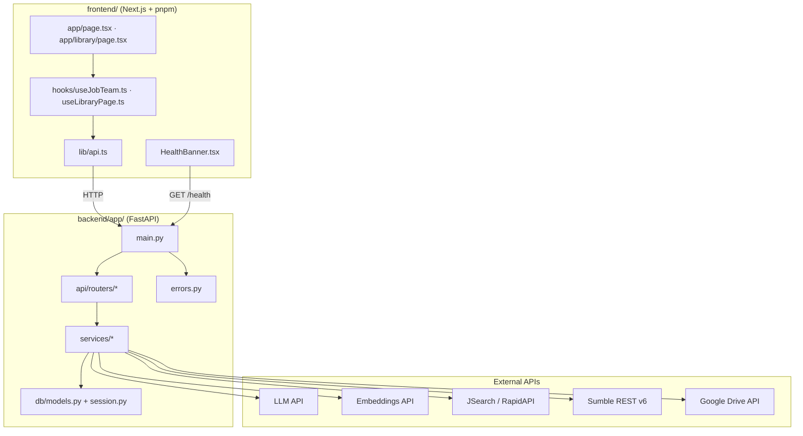
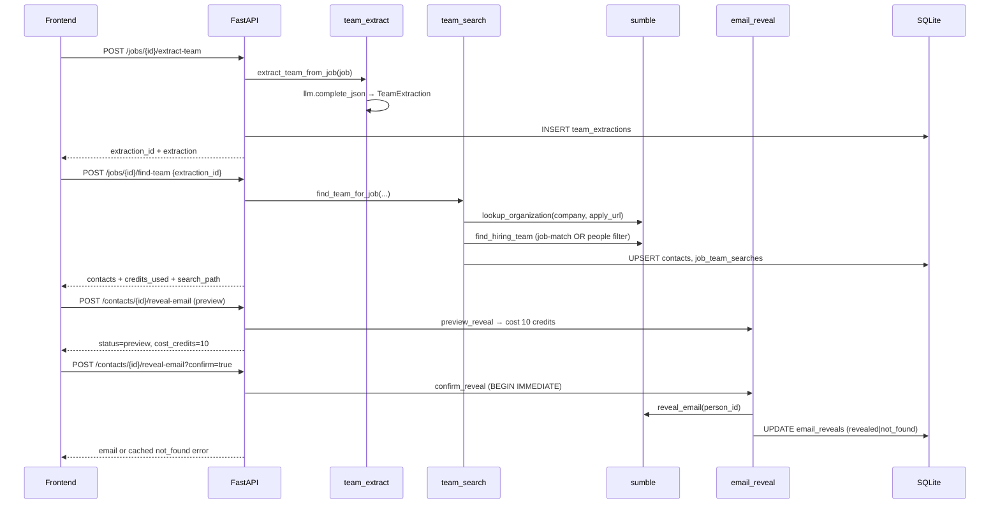

# TeamScout (jobright) — Codebase Understanding

> **Last reviewed:** 2026-07-08  
> **App version:** `0.4.0-m4` (`backend/app/main.py`)  
> **Milestone note:** The repo implements **Milestone 4** on top of the M3 honesty layer. `AGENTS.md` describes M3 scope; `SPEC.md` and `README.md` describe the active M4 product scope.

---

## 1. Project Overview

### Purpose

**TeamScout** is a recruiting intelligence platform. It helps recruiters and candidates:

1. **Feature 1 (M3):** Upload a resume → confirm profile → search and rank live jobs → extract hiring-team signals from a JD → find people via Sumble → gated email reveal.
2. **Feature 2 (M4):** Ingest a resume library (upload / ZIP / Google Drive) → intent-based job search → pick the best resume for a job with transparent scoring, JD coverage, and LLM justification.

### Milestone scope

| In scope (M4) | Out of scope |
|---|---|
| Resume parsing + confirmation (M2) | PostgreSQL, pgvector, ParadeDB |
| JSearch jobs fetch + SQLite cache (M2) | Queues / DLQ |
| Hybrid ranking: dense + BM25 + RRF + LLM rerank (M2/M4 refactor) | Outreach, applications tracker |
| Team extraction + Sumble people search + email reveal (M3) | Beta sidebar tabs (UI shows disabled placeholders) |
| Resume library, Drive sync, intent search, best-resume pick (M4) | Auto-submit |
| Honesty layer: hard-fail unconfigured services | Mock data in `backend/app/` |
| `/health` config-presence checks (`configured` \| `missing`) | Live integration probes (reserved for later) |
| Google Drive sync (optional in `/health`; hard-fail on `POST /library/drive/sync` when unconfigured) | — |

### Honesty layer (hard rules)

From `AGENTS.md`, `SPEC.md`, and `backend/app/errors.py`:

- **No mocks** importable from application code — fixtures only in `backend/tests/` and `scripts/fixtures/`.
- **No silent fallbacks** for LLM, embeddings, jobs API, Sumble, or Drive.
- Unconfigured services raise `ServiceNotConfiguredError` → HTTP **503** JSON.
- Failed HTTP calls raise `ServiceFailingError` → HTTP **503** JSON.
- `/health` returns `ok: false` if DB ping fails or any **required** integration is `missing`. M2–M4 health is **config-presence only** — check functions return only `"configured"` or `"missing"` (`backend/app/services/health.py`); they never emit `"failing"` today. The `CheckStatus` type and frontend banner also handle `"failing"` for forward compatibility, but live probes are reserved for later milestones.
- Runtime API failures (e.g. Sumble HTTP error) surface as `ServiceFailingError` → HTTP **503** on the **individual request**, not via `/health` check values.
- Credit-costing Sumble calls logged at INFO with redacted URLs (`backend/app/services/sumble.py`).
- Frontend shows a **red degraded banner** when health is not fully green; banner hidden while loading (`frontend/components/HealthBanner.tsx`).

---

## 2. Repository Structure

```
jobright/
├── AGENTS.md              # Agent/contributor rules (M3 framing)
├── SPEC.md                # Active M4 product spec
├── README.md              # Demo + dev commands
├── CODEBASE.md            # This document
├── Makefile               # dev, install, test
├── .env.example           # All secrets + tuning knobs
├── samples/
│   └── sample_resume.pdf  # Demo resume
├── backend/
│   ├── requirements.txt
│   ├── pytest.ini
│   ├── uploads/           # Persisted resume files (runtime)
│   ├── teamscout.db       # SQLite DB (runtime, gitignored pattern)
│   ├── app/
│   │   ├── main.py        # FastAPI entry
│   │   ├── errors.py      # Typed error hierarchy
│   │   ├── api/routers/   # HTTP route handlers
│   │   ├── core/          # config.py, logging.py, env_utils.py (is_set)
│   │   ├── db/            # base.py (SQLAlchemy Base), models.py, session.py
│   │   ├── schemas/       # Pydantic v2 DTOs — resume, jobs, team, library
│   │   └── services/      # Business logic + external clients
│   └── tests/             # pytest suite (respx for HTTP mocks)
├── frontend/
│   ├── app/               # Next.js App Router pages
│   ├── components/        # UI panels
│   ├── hooks/             # Page-level state machines
│   ├── lib/               # api.ts, format.ts
│   └── package.json       # pnpm + vitest
└── scripts/
    ├── smoke_api.py       # TestClient end-to-end smoke
    ├── smoke_sumble.py    # Live Sumble smoke (SKIP if no key)
    ├── eval_ranking.py    # Ranking quality eval
    ├── eval_resume_pick.py
    └── fixtures/          # Eval fixture data (not imported by app)
```

**Note:** Tests live under `backend/tests/`, not a top-level `tests/` directory.

**Schema modules** (`backend/app/schemas/`): `resume.py` (profile DTOs), `jobs.py` (`Job`, `RankedJob`, `ScoreBreakdown`), `team.py` (extraction, contacts, email reveal), `library.py` (intent, library ingest, resume recommendations).

---

## 3. Architecture

### High-level component diagram



### Request lifecycle

1. **Startup** (`main.py` lifespan): configure logging → validate ranking weights sum to 1.0 → `init_db()` (create tables + lightweight SQLite migrations).
2. **Router** receives request, validates with Pydantic schemas, opens DB session via `get_db()`.
3. **Service** performs work; external calls hard-fail if unconfigured.
4. **TeamScoutError** caught by global handler → structured JSON `{ error, message, details }`.
5. **SQLite** persists resumes, jobs cache, searches, contacts, email reveals, library state.

### CORS

`CORSMiddleware` allows origins from `CORS_ORIGINS` in `.env` (default `http://localhost:3000,http://127.0.0.1:3000` per `backend/app/core/config.py`).

---

## 4. Backend Deep-Dive

### 4.1 FastAPI entry (`backend/app/main.py`)

- **Version:** `0.4.0-m4`
- **Routers mounted:**
  - `resumes` → `/resumes`
  - `searches` → `/searches`
  - `jobs` → `/jobs`
  - `contacts` → `/contacts`
  - `library` → `/library`
- **Global exception handler:** `TeamScoutError` → JSONResponse with `exc.status_code`.
- **`GET /health`:** delegates to `run_health_checks()`; returns 200 if `ok`, else 503.

### 4.2 Routers

| Router | File | Prefix | Responsibility |
|---|---|---|---|
| Resumes | `api/routers/resumes.py` | `/resumes` | Upload PDF/DOCX, confirm profile |
| Searches | `api/routers/searches.py` | `/searches` | Resume-driven job search + rank |
| Jobs | `api/routers/jobs.py` | `/jobs` | Team extract, find-team, list team |
| Contacts | `api/routers/contacts.py` | `/contacts` | Email reveal preview/confirm |
| Library | `api/routers/library.py` | `/library` | Library ingest, intent search, resume pick |

**Thin router pattern:** Routers validate input, load DB rows, delegate to services. Team search logic was extracted to `services/team_search.py` (M4 structural debt fix). Re-searching a job **updates** the existing `job_team_searches` row (`job_id` is unique) and upserts `contacts` — it does not create duplicate team-search records.

### 4.3 Services

| Service | File | Role |
|---|---|---|
| `parser` | `services/parser.py` | PyMuPDF (PDF) + python-docx (DOCX) text extraction; SHA-256 content hash; max 10 MiB (`MAX_UPLOAD_BYTES`); LLM structuring → `ResumeProfile` |
| `llm` | `services/llm.py` | OpenAI-compatible chat completions; `complete_json()` with fence-stripping + schema validation + one retry |
| `embeddings` | `services/embeddings.py` | OpenAI-compatible embeddings; L2-normalized vectors; single + batch |
| `jobs` | `services/jobs.py` | JSearch RapidAPI client; ~150 jobs; 14-day recency filter; SQLite cache upsert |
| `jobs_store` | `services/jobs_store.py` | `resolve_job(job_id)` — indexed lookup in `jobs_cache.job_id` |
| `ranking_math` | `services/ranking_math.py` | Tokenization, cosine sim, RRF (k=60), score normalization, skill Jaccard, recency half-life, weighted fuse |
| `hybrid_rank` | `services/hybrid_rank.py` | **Shared orchestrator:** dense rank → BM25 rank → RRF → optional LLM rerank top 30 → fuse → top N |
| `ranking` | `services/ranking.py` | Thin wrapper: profile → jobs ranking (resume/intent search); `rank_jobs_dense_only()` for eval baseline |
| `resume_ranking` | `services/resume_ranking.py` | Thin wrapper: job → library resumes; scores **all** candidates (pool=`all`); coverage + rationale validation |
| `team_extract` | `services/team_extract.py` | LLM extracts `team_name`, `department`, `likely_hiring_titles` from cached job JD |
| `sumble` | `services/sumble.py` | Sumble REST v6 client: org lookup, title-lookup, people filter, job-post match, related people, email enrich |
| `team_search` | `services/team_search.py` | Orchestrates Sumble lookup + persists `Contact` rows + `JobTeamSearch` metadata |
| `email_reveal` | `services/email_reveal.py` | Two-step reveal: preview cost / confirm spend; SQLite `BEGIN IMMEDIATE` billing lock; terminal cache (`revealed`, `not_found`) |
| `library_store` | `services/library_store.py` | Hash-dedup library ingest; ZIP expansion; Drive sync state; `load_candidates()` |
| `drive` | `services/drive.py` | Google Drive v3 list (paginated) + download; API key or OAuth refresh token |
| `health` | `services/health.py` | Config-presence checks per integration |

### 4.4 Database models (`backend/app/db/models.py`)

SQLite via SQLAlchemy 2.0 declarative style.

| Table | Purpose | Notable columns (non-exhaustive) |
|---|---|---|
| `resumes` | Uploaded + library resumes | `content_hash` (unique), `file_path`, `parsed_json`, `confirmed`, `in_library`, `source`, `created_at` |
| `jobs_cache` | Cached JSearch jobs | `id`, `job_id` (indexed), `source`, `source_job_id`, `title`, `payload_json` (full `Job` JSON), `fetched_at` |
| `searches` | Resume-driven search history | `resume_id`, `label`, `query_json`, `results_json`, `created_at` |
| `intent_searches` | Intent form search history | `role`, `years_of_experience`, `location`, `remote_preference`, `query_json`, `results_json`, `created_at` |
| `drive_sync_state` | Per-folder sync metadata | `folder_id` (unique), `folder_url`, `last_synced_at` |
| `drive_synced_files` | Incremental Drive sync | `(folder_id, file_id)` unique; `filename`, `modified_time`, `content_hash`, `synced_at` |
| `team_extractions` | LLM extraction records | `job_id`, `extraction_json`, `content_hash`, `created_at` |
| `job_team_searches` | One row per job team search | `job_id` (unique), `extraction_id`, `search_id`, `team_searched_at`, `search_path`, `credits_used` |
| `contacts` | Sumble people per job | `(sumble_person_id, job_id)` unique; `full_name`, `title`, `search_id`, `extraction_id` |
| `email_reveals` | Email reveal billing state | `contact_id` unique; `sumble_person_id`, `email`, `cost_credits`; `status`: pending/revealed/not_found |

**Migrations:** `db/session.py` runs lightweight `ALTER TABLE` on startup for M4 columns (`in_library`, `source`, `jobs_cache.job_id` backfill). No Alembic.

**Job ID stability:** When re-fetching jobs, `_cached_job_id()` reuses existing UUIDs so frontend `job_id` references remain valid across searches.

### 4.5 Error handling (`backend/app/errors.py`)

| Class | HTTP | `error_code` | When |
|---|---|---|---|
| `ServiceNotConfiguredError` | 503 | `service_not_configured` | Missing API key / base URL |
| `ServiceFailingError` | 503 | `service_failing` | HTTP failure or bad response shape |
| `ValidationError` | 400 | `validation_error` | Business rule / input validation |
| `NotFoundError` | 404 | `not_found` | Missing resume, job, contact |
| `TeamScoutError` | 500 | `internal_error` | Base class |

### 4.6 Health endpoint (`backend/app/services/health.py`)

**Required checks:** `llm`, `embeddings`, `jobs_api`, `sumble`  
**Optional:** `google_drive`

M4 `/health` is **config-presence only**. Each `check_*()` function returns `"configured"` or `"missing"` — never `"failing"`. Live API probes are reserved for later milestones.

```json
{
  "ok": false,
  "checks": {
    "llm": "missing",
    "embeddings": "configured",
    "jobs_api": "missing",
    "sumble": "configured",
    "google_drive": "missing"
  },
  "required_checks": ["llm", "embeddings", "jobs_api", "sumble"],
  "optional_checks": ["google_drive"],
  "db": true
}
```

- `ok` is true only when `db` pings successfully **and** all required checks are `"configured"`.
- `"failing"` exists in the `CheckStatus` type alias and frontend banner for forward compatibility, but the backend health service does not perform live probes or emit it today.
- Whitespace-only env values count as missing (`core/env_utils.py:is_set`).
- HTTP status: 200 if `ok`, else 503.
- **Drive distinction:** `google_drive: "missing"` does **not** make `ok` false (optional check). Calling `POST /library/drive/sync` without Drive config still raises `ServiceNotConfiguredError` on that request.

### 4.7 Configuration (`backend/app/core/config.py`)

Loads repo-root `.env` (falls back to `backend/.env`). Key settings:

| Category | Env vars |
|---|---|
| DB | `DATABASE_URL` (default `sqlite:///./teamscout.db`) |
| LLM | `LLM_API_KEY`, `LLM_API_BASE`, `LLM_MODEL` |
| Embeddings | `EMBEDDINGS_API_KEY`, `EMBEDDINGS_API`, `EMBEDDINGS_MODEL` |
| Jobs | `JOBS_API_KEY`, `JOBS_API_BASE`, `JOBS_API_HOST` |
| Sumble | `SUMBLE_API_KEY`, `SUMBLE_BASE_URL`, `SUMBLE_SEARCH_LIMIT`, `SUMBLE_JOB_MATCH_LIMIT` |
| Drive | `GOOGLE_DRIVE_API_KEY` or OAuth trio |
| Ranking | `RANKING_WEIGHT_*`, `RRF_K`, `JOBS_FETCH_TARGET`, `RERANK_TOP_N`, `SEARCH_RESULTS_TOP_N`, `RESUME_RECOMMEND_TOP_N` |

Ranking weights validated at startup: must sum to ~1.0.

---

## 5. Frontend Deep-Dive

### 5.1 Next.js structure

| Path | Role |
|---|---|
| `app/layout.tsx` | Root layout, global CSS |
| `app/page.tsx` | **Feature 1:** Resume wizard + job results + team discovery |
| `app/library/page.tsx` | **Feature 2:** Library ingest + intent search + resume recommendations |
| `components/AppShell.tsx` | Sidebar + HealthBanner + toast slot |
| `components/Sidebar.tsx` | Nav links; disabled Beta tabs with "Coming soon" tooltip |

### 5.1b Components by feature flow

| Component | File | Feature flow |
|---|---|---|
| `ResumeWizard` | `components/ResumeWizard.tsx` | Feature 1 — upload, confirm, search |
| `JobResultsList` | `components/JobResultsList.tsx` | Feature 1 — ranked jobs, score breakdown, team panel host |
| `TeamDiscoveryPanel` | `components/TeamDiscoveryPanel.tsx` | Feature 1 — extract team, Sumble search, email reveal |
| `LibraryIngestPanel` | `components/LibraryIngestPanel.tsx` | Feature 2 — local/ZIP upload, Drive sync |
| `IntentSearchPanel` | `components/IntentSearchPanel.tsx` | Feature 2 — intent form → job search |
| `ResumeRecommendations` | `components/ResumeRecommendations.tsx` | Feature 2 — pick job, show top 3 resumes + coverage |
| `HealthBanner` | `components/HealthBanner.tsx` | Shared — degraded-state alert |

### 5.2 API client (`frontend/lib/api.ts`)

- Base URL: `NEXT_PUBLIC_API_BASE` (default `http://localhost:8000`).
- Typed TypeScript interfaces mirror backend Pydantic schemas.
- Internal `parseError()` helper (not exported) extracts `message` from backend JSON errors; exported functions throw `Error` with that message.
- Functions: `uploadResume`, `confirmResume`, `createSearch`, `extractTeam`, `findTeam`, `getJobTeam`, `revealEmail`, `listLibraryResumes`, `uploadLibrary`, `syncDrive`, `intentSearch`, `recommendResumes`.

### 5.3 Hooks

**`hooks/useJobTeam.ts`** — per-job team state machine:

- State keyed by `jobId`: extraction, contacts, `searchPath`, reveal preview costs, loading flags.
- `hydrateJobTeam` — lazy-load cached team on score-breakdown expand.
- `handleRevealEmail(contact, confirm)` — two-step: preview (`confirm=false`) → confirm (`?confirm=true`).

**`hooks/useLibraryPage.ts`** — library page orchestration:

- Loads library on mount; handles upload, Drive sync, intent search, resume pick.

### 5.4 User flows

#### Feature 1: Resume → Jobs → Team (`app/page.tsx`)

1. **Upload** (`ResumeWizard`) → `POST /resumes/upload`
2. **Confirm** editable title/location/skills → `PUT /resumes/{id}/confirm` (only these three fields are user-editable; `name`, `years_of_experience`, `work_experience`, and `summary` from LLM parsing are read-only in the confirm step)
3. **Search jobs** (requires confirmed + non-dirty profile) → `POST /searches`
4. **Per job** (`JobResultsList` + `TeamDiscoveryPanel`):
   - Open **Score breakdown** `<details>` → `GET /jobs/{id}/team` (hydrate)
   - Extract team → `POST /jobs/{id}/extract-team`
   - Confirm & search Sumble → `POST /jobs/{id}/find-team`
   - Preview/confirm email → `POST /contacts/{id}/reveal-email`

#### Feature 2: Library (`app/library/page.tsx`)

1. **Ingest** PDF/DOCX/ZIP or Drive sync → `POST /library/upload` or `POST /library/drive/sync`
2. **Intent search** → `POST /library/intent/search` (fetches jobs via JSearch and caches them in `jobs_cache`; ranked results include stable `job.id` values)
3. **Pick best resume** per job → `POST /library/jobs/{job_id}/recommend-resumes` — `job_id` must come from intent-search results (`useLibraryPage` → `ResumeRecommendations` “Pick best resume” button). The handler calls `jobs_store.resolve_job()` against `jobs_cache`; an unknown ID returns 404.
4. View score breakdown, coverage table, LLM rationale (`ResumeRecommendations`)

### 5.5 Health banner / degraded UX (`frontend/components/HealthBanner.tsx`)

- Polls `GET /health` every 30s.
- Returns `null` while loading (**no flash**).
- Returns `null` when fully healthy.
- Shows red `role="alert"` banner when:
  - Backend unreachable
  - `health.ok === false` (typically because a required check is `missing` or `db` is false)
  - `db === false`
  - Any **non-optional** check equals `missing` (the usual degradation path in M4)
- The banner also handles `failing` in its loop for forward compatibility, but the backend never supplies that status today.
- `google_drive` is optional — missing Drive config does **not** trigger banner.

### 5.6 Shared utilities

- `lib/format.ts` — `formatPostedAt()` for job cards.

---

## 6. Key API Endpoints

| Method | Route | Purpose | Router file |
|---|---|---|---|
| `GET` | `/health` | Integration + DB health | `main.py` |
| `POST` | `/resumes/upload` | Parse resume file → `ResumeProfile` | `resumes.py` |
| `PUT` | `/resumes/{id}/confirm` | Confirm editable profile fields | `resumes.py` |
| `POST` | `/searches` | Fetch jobs, hybrid rank, return top 10 | `searches.py` |
| `POST` | `/jobs/{job_id}/extract-team` | LLM team extraction from cached JD | `jobs.py` |
| `POST` | `/jobs/{job_id}/find-team` | Sumble people search | `jobs.py` |
| `GET` | `/jobs/{job_id}/team` | List cached contacts + latest extraction | `jobs.py` |
| `POST` | `/contacts/{id}/reveal-email` | Preview (`confirm=false`) or confirm reveal | `contacts.py` |
| `GET` | `/library/resumes` | List library resumes | `library.py` |
| `POST` | `/library/upload` | Multi-file / ZIP ingest | `library.py` |
| `POST` | `/library/drive/sync` | Sync public Drive folder | `library.py` |
| `POST` | `/library/intent/search` | Intent profile → jobs → rank | `library.py` |
| `POST` | `/library/jobs/{job_id}/recommend-resumes` | Top 3 library resumes for job | `library.py` |

---

## 7. External Integrations

| Integration | Service file | Config | Behavior |
|---|---|---|---|
| **LLM** | `llm.py` | `LLM_API_KEY`, `LLM_API_BASE` | Resume parsing, job rerank, team extract, resume pick + coverage |
| **Embeddings** | `embeddings.py` | `EMBEDDINGS_API_KEY`, `EMBEDDINGS_API` | Dense retrieval (BGE-M3 default) |
| **JSearch** | `jobs.py` | `JOBS_API_KEY`, `JOBS_API_BASE` | RapidAPI job search; 5 pages; FULLTIME; recency filter |
| **Sumble** | `sumble.py` | `SUMBLE_API_KEY` | Org resolve, people search, job-related people, email enrich |
| **Google Drive** | `drive.py` | API key **or** OAuth refresh | Paginated folder listing; PDF/DOCX only |

All secrets live in repo-root `.env` (see `.env.example`). Never logged.

### Sumble client details (`services/sumble.py`)

Conforms to Sumble OpenAPI v6:

- `POST /v6/organizations` — org resolve (name + derived domain from apply URL)
- `POST /v6/jobs/title-lookup` — map LLM titles → `job_function` / `job_level`
- `POST /v6/people` — filter-mode people search **or** list-mode email enrich
- `POST /v6/jobs` — org job posts search **or** related_people for matched post

**Team search paths** (`find_hiring_team`):

1. **Primary:** Match org job post by title similarity → `related_people` → label `"Matched Sumble job post"`
2. **Fallback:** People filter by `job_function` / `job_level` DSL → label `"Filtered by function/level"`

Credit-costing calls log `sumble.credit_call` and `sumble.credit_result` at INFO.

---

## 8. Ranking Pipeline

### Shared orchestrator (`services/hybrid_rank.py`)

Used by both job search and resume pick (M4 refactor).

```
Candidates + Query text
        │
        ▼
┌───────────────────┐
│ Dense ranking     │  embeddings.embed(query) + embed_batch(candidates)
│ (cosine sim)      │
└─────────┬─────────┘
          │
┌─────────▼─────────┐
│ BM25 lexical rank │  rank_bm25.BM25Okapi on tokenized text
└─────────┬─────────┘
          │
┌─────────▼─────────┐
│ RRF fuse (k=60)   │  reciprocal_rank_fusion([dense_ids, lexical_ids])
│ + normalize       │
└─────────┬─────────┘
          │
┌─────────▼─────────┐
│ LLM rerank        │  Top RERANK_TOP_N (30) only
│ (optional)        │  Validates exact job_id/resume_id coverage
└─────────┬─────────┘
          │
┌─────────▼─────────┐
│ Weighted fuse     │  0.5·LLM + 0.3·RRF + 0.1·skills + 0.1·recency
│ → top N           │
└───────────────────┘
```

Resume pick reuses the recency weight slot for experience scoring — see **Resume pick** below.

### Job search (`services/ranking.py`)

- Query: `ResumeProfile.search_text()` (title, location, skills, summary, work history).
- Skill overlap: Jaccard(profile.skills, job.skills).
- Recency: exponential half-life (`RECENCY_HALF_LIFE_DAYS=7`).
- Returns top `SEARCH_RESULTS_TOP_N` (10) as `RankedJob` with transparent `ScoreBreakdown`.

### Resume pick (`services/resume_ranking.py`)

- Query: job title + company + location + skills + description snippet.
- **Scores entire library** (`score_pool="all"`) — candidates beyond top 30 RRF still get RRF + skill + experience scores.
- LLM rerank adds `coverage[]` (requirement hit/miss + evidence) and validates rationale references resume content.
- Returns top `RESUME_RECOMMEND_TOP_N` (3).
- **Weighting note:** Fusion still uses `RANKING_WEIGHT_RECENCY` via `fuse_final_score()`; `_experience_score()` is passed as `recency_fn`. The API `ScoreBreakdown` exposes `experience_fit` (with `recency=0.0`) — there is no separate experience weight env var.

### Eval scripts

- `scripts/eval_ranking.py` — NDCG@10 and MRR on fixture personas. Always calls `ranking.rank_jobs(..., use_llm=False)` (`eval_ranking.py:47`) — retrieval-heavy hybrid (dense + BM25 + RRF + skills + recency) **without** LLM rerank, even when LLM is configured. Compares against `rank_jobs_dense_only()`. The printed NOTE about missing LLM is informational only; the script never exercises production LLM rerank.
- `scripts/eval_resume_pick.py` — expects best resume #1 in ≥4/5 fixture cases. Degrades to retrieval-only ranking (`use_llm=False`) when LLM is unconfigured; still requires embeddings.

---

## 9. Team / Contact Flow (End-to-End)



### No double-charge guarantees (`email_reveal.py`)

- `email_reveals.contact_id` is **unique** — one billing row per contact.
- **`pending` guard:** concurrent `confirm=true` requests for the same contact raise `ValidationError` while status is `pending` (`email_reveal.py:94-99`).
- Terminal statuses (`revealed`, `not_found`) return cached result without re-calling Sumble.
- `not_found` is committed **before** raising `ValidationError` so retries don't re-spend credits.
- SQLite `BEGIN IMMEDIATE` prevents concurrent double-spend on the same contact.

---

## 10. Testing & Scripts

### pytest layout (`backend/tests/`)

| File | Focus |
|---|---|
| `conftest.py` | In-memory SQLite; strips all API keys; TestClient fixture; sample PDF generator |
| `test_health.py` | Health ok/missing/db-failure/whitespace keys |
| `test_api.py` | Upload, confirm, search, library flows (mocked externals) |
| `test_parser.py` | PDF/DOCX extraction |
| `test_ranking_math.py` | RRF, fuse, Jaccard, recency |
| `test_ranking_llm.py` | LLM rerank validation (mocked) |
| `test_resume_ranking.py` | Resume pick ordering, 35+ pool, rationale checks |
| `test_jobs.py` | JSearch client (respx) |
| `test_jobs_store.py` | Job cache resolution |
| `test_sumble.py` | Sumble client (respx) |
| `test_library.py` | Library ingest, Drive sync (mocked) |
| `test_services.py` | Misc service unit tests |

**Pattern:** External HTTP mocked with `respx` or `unittest.mock.patch` — never in app code.

### Frontend tests

- `frontend/components/HealthBanner.test.tsx` — vitest; banner visibility rules.

### Scripts

| Script | Purpose |
|---|---|
| `scripts/smoke_api.py` | FastAPI TestClient; exercises health, upload, search, library (all mocked services) |
| `scripts/smoke_sumble.py` | Live Sumble when `SUMBLE_API_KEY` set; **SKIP exit 0** when missing |
| `scripts/eval_ranking.py` | Ranking quality metrics; SKIP if embeddings missing |
| `scripts/eval_resume_pick.py` | Resume pick accuracy; SKIP if embeddings missing |

### Make targets

```bash
make dev      # backend :8000 + frontend :3000
make install  # pip + pnpm
make test     # pytest + pnpm test
```

---

## 11. Data Flow Walkthrough

**Complete journey: resume upload → contact email reveal**

1. **User uploads** `samples/sample_resume.pdf` in `ResumeWizard`.
2. **Frontend** `POST /resumes/upload` with multipart form.
3. **`parser.parse_resume_file`** extracts text (PyMuPDF), hashes content, calls **`llm.complete_json`** → `ResumeProfile`.
4. **Content-hash dedup:** if `content_hash` already exists, `POST /resumes/upload` returns the existing row without re-parsing (`resumes.py:53-62`). Otherwise SQLite inserts a new `resumes` row; file saved to `backend/uploads/{hash}_{filename}`.
5. **User edits** title/location/skills, clicks **Confirm profile**.
6. **`PUT /resumes/{id}/confirm`** sets `confirmed=true`, updates `parsed_json`.
7. **User clicks Search jobs** → `POST /searches` with `{ resume_id }`.
8. **`jobs.fetch_jobs`** builds JSearch query (`title + top 2 skills + location`), fetches up to 150 jobs, filters 14-day recency, caches in `jobs_cache`.
9. **`ranking.rank_jobs`** runs hybrid pipeline → top 10 `RankedJob` results stored in `searches.results_json`.
10. **Frontend** renders `JobResultsList` with scores, chips, rationale.
11. **User opens Score breakdown** (`JobResultsList.tsx` `<details>` toggle) → `hydrateJobTeam` → `GET /jobs/{id}/team` (may be empty initially).
12. **User clicks Extract team** → `POST /jobs/{id}/extract-team`.
13. **`team_extract.extract_team_from_job`** LLM-reads JD from cached job → `TeamExtraction` saved to `team_extractions`.
14. **UI shows** team name, department, likely hiring titles + credit estimate.
15. **User clicks Confirm & search Sumble** → `POST /jobs/{id}/find-team` with `extraction_id` + `search_id`.
16. **`team_search.find_team_for_job`**:
    - `sumble.lookup_organization(company, apply_url)`
    - `sumble.find_hiring_team` (job-post match path or people filter fallback)
    - Upserts `contacts` rows; records `job_team_searches` with `search_path` and `credits_used`.
17. **Frontend** lists contacts with titles; shows search path label.
18. **User clicks Reveal email — preview cost** → `POST /contacts/{id}/reveal-email`.
19. **`email_reveal.preview_reveal`** returns `cost_credits=10`, `status=preview` (or cached terminal result).
20. **User confirms** → `POST /contacts/{id}/reveal-email?confirm=true`.
21. **`email_reveal.confirm_reveal`** acquires billing lock, calls `sumble.reveal_email`, persists `email_reveals`, returns email.
22. **Frontend** displays email inline on contact card.

---

## 12. Notable Patterns & Conventions

### For new contributors

1. **Honesty first:** If an API key is missing, raise `ServiceNotConfiguredError` at call time — never return placeholder data.
2. **Thin routers, fat services:** HTTP handlers stay small; put orchestration in `services/`.
3. **Pydantic everywhere:** `schemas/` for API DTOs; DB rows store JSON blobs (`parsed_json`, `payload_json`, `extraction_json`).
4. **Content-hash dedup:** Resumes keyed by SHA-256; re-upload returns existing row.
5. **Job ID stability:** Cache lookups preserve `job.id` across JSearch refetches.
6. **Shared ranking:** Add new rank modes via `hybrid_rank.py` + thin wrapper — don't duplicate RRF/fuse math.
7. **Sumble conformance:** Only documented v6 endpoints/fields; credit calls logged with redacted URLs.
8. **SQLite concurrency:** Email reveal uses `BEGIN IMMEDIATE`; tests use `:memory:` with `StaticPool`.
9. **Frontend state:** Complex multi-step flows use dedicated hooks (`useJobTeam`, `useLibraryPage`), not global state.
10. **Mocks location:** Only `backend/tests/` and `scripts/fixtures/` — grep for `patch(` in tests, not in `app/`.
11. **Env loading:** Backend reads repo-root `.env`; frontend needs `NEXT_PUBLIC_API_BASE` at build/runtime.
12. **Error UX:** Frontend surfaces `message` from backend JSON; health banner is the only always-on degradation signal.

### M3 → M4 evolution (what changed)

| Area | M3 | M4 addition |
|---|---|---|
| Ranking | Inline in `ranking.py` | Extracted `hybrid_rank.py`; `resume_ranking.py` for inverse query |
| Team search | Logic in router | `team_search.py` service |
| Job lookup | Scan cache payloads | Indexed `jobs_cache.job_id` + `jobs_store.resolve_job` |
| Frontend | Monolithic page | Decomposed components + hooks; `/library` page |
| DB | contacts, email_reveals | Library tables, intent_searches, drive sync state |
| Health | 4 required checks | `google_drive` optional |

---

## Quick Reference: File → Responsibility

```
backend/app/main.py              → App entry, CORS, health, error handler
backend/app/errors.py            → Typed errors
backend/app/core/config.py       → Settings from .env
backend/app/core/env_utils.py    → is_set() for health + service guards
backend/app/core/logging.py      → Structured logging setup
backend/app/db/base.py           → SQLAlchemy declarative Base
backend/app/db/models.py         → SQLAlchemy schema
backend/app/db/session.py        → Engine, migrations, get_db
backend/app/services/hybrid_rank.py → Ranking orchestrator
backend/app/services/sumble.py   → Sumble REST client
backend/app/services/email_reveal.py → Billing-safe email reveal
frontend/lib/api.ts              → All backend HTTP calls
frontend/hooks/useJobTeam.ts     → Team discovery state machine
frontend/components/HealthBanner.tsx → Degraded mode UX
scripts/smoke_api.py             → CI-friendly API smoke test
```

---

*This document reflects the codebase as of Milestone 4. For acceptance criteria and demo steps, see `SPEC.md` and `README.md`.*