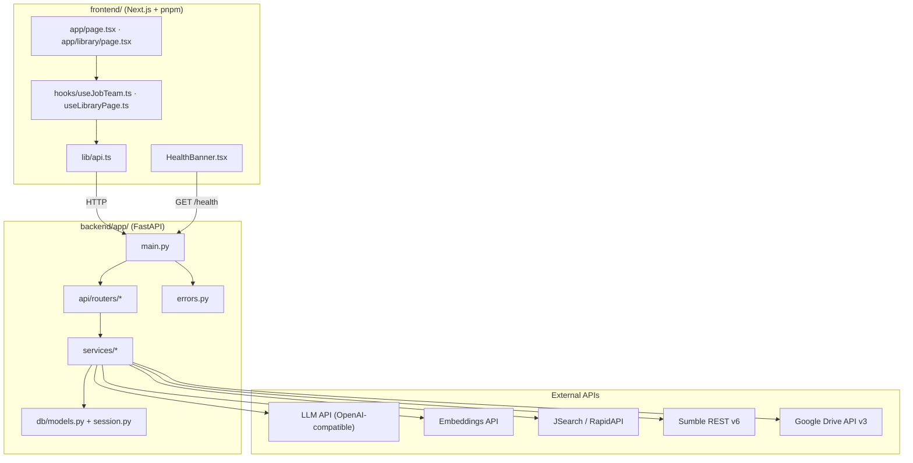
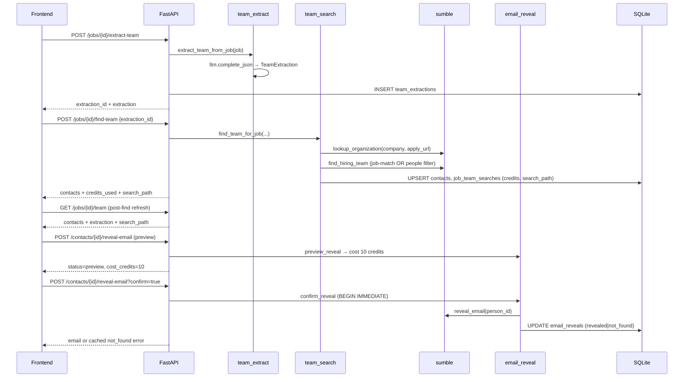

# TeamScout (jobright) — Codebase Understanding

> **Last reviewed:** 2026-07-08  
> **App version string:** `0.4.0-m4` (`backend/app/main.py`) — **not bumped** after later Sumble work  
> **Implementation reality:** M1–M4 product features are present, plus **M5** (Sumble real-API alignment) and **M6** (Sumble polish, credit aggregation, email-reveal terminal-state fix).  
> **Doc drift:** `AGENTS.md` is still M3-framed; `SPEC.md` / `README.md` describe M4 product scope and do not cover M5/M6 Sumble changes. Prefer **this file** for architecture truth.

---

## 1. Project Overview

### Purpose

**TeamScout** is a recruiting intelligence platform. As implemented on disk:

1. **Feature 1 (M2–M3 + M5/M6 Sumble):** Upload a resume → confirm profile → search and rank live jobs → extract hiring-team signals from a JD → find people via Sumble → gated email reveal.
2. **Feature 2 (M4):** Ingest a resume library (upload / ZIP / Google Drive) → paste a job description → best-resume pick (top 3 + coverage + LLM justification). Backend also retains intent-search APIs for smoke/tests; they are not the active UI path.

### Milestone reality (what code actually has)

| Milestone | Status in code | What landed |
|---|---|---|
| **M1** | Present | FastAPI shell, honesty errors, structured logging, health skeleton |
| **M2** | Present | Resume parse/confirm, JSearch jobs + SQLite cache, hybrid ranking |
| **M3** | Present | Team extract, Sumble people search, contacts + email reveal, Feature 1 UI |
| **M4** | Present | Library ingest, Drive sync, paste-JD best-resume pick (primary UI), retained intent-search APIs; job `hybrid_rank`, resume MaxSim |
| **M5** | Present (git: *Milestone 5: Fix Sumble to real API + cleanup*) | Sumble OpenAPI v6 rewrite; org domain heuristic; job-post match → related_people primary path; people filter fallback; `search_path` persisted/returned; jobs query uses ≤2 skills; frontend credit estimates + path label |
| **M6** | Present (git: *Milestone 6* + review follow-up + test signature fix) | `SUMBLE_JOB_MATCH_LIMIT`; title-lookup slug preference; credit aggregation (org + path); email-reveal `not_found` commit-before-raise; expanded `test_sumble.py` |

**Version string caveat:** FastAPI still advertises `version="0.4.0-m4"`. Treat that as stale labeling, not “code stopped at M4.”

### In scope vs out of scope (product)

| Implemented | Not implemented |
|---|---|
| Resume parsing + confirmation | PostgreSQL, pgvector, ParadeDB |
| JSearch jobs fetch + SQLite cache | Queues / DLQ |
| Hybrid ranking: dense + BM25 + RRF + LLM rerank | Outreach, applications tracker, auto-submit |
| Team extraction + Sumble people search + email reveal | Live `/health` probes (`"failing"` never emitted by health checks today) |
| Resume library, Drive sync, paste-JD → best-resume pick (intent-search APIs retained for smoke/tests) | Working Beta sidebar tabs (UI shows disabled placeholders only) |
| Honesty layer: hard-fail unconfigured services | Mock data importable from `backend/app/` |
| Sumble v6 paths, credits aggregation, redacted credit logs | Alembic migrations (empty `backend/alembic/versions/`; schema via `create_all` + SQLite `ALTER`) |

### Honesty layer (hard rules)

From `AGENTS.md`, `SPEC.md`, and `backend/app/errors.py` — verified against code:

- **No mocks** importable from application code — fixtures only in `backend/tests/` and `scripts/fixtures/`.
- **No silent fallbacks for missing keys / failed HTTP** on LLM, embeddings, jobs API, Sumble, or Drive: raise `ServiceNotConfiguredError` or `ServiceFailingError` → HTTP **503** JSON.
- **Within-Sumble strategy fallbacks are intentional** (not honesty violations): title-lookup HTTP failure falls back to raw titles; org resolve tries domain then name; hiring-team prefers job-post match then people filter. Keys still hard-fail; exhausted org resolve still hard-fails.
- `/health` is **config-presence only** for integrations: each `check_*()` returns only `"configured"` or `"missing"`. The `CheckStatus` type and frontend banner also understand `"failing"` for forward compatibility, but **backend health never emits `"failing"` today**. Runtime API failures surface as 503 on the **individual request**, not via health check values.
- Credit-costing Sumble calls log `sumble.credit_call` / `sumble.credit_result` at INFO with redacted URLs (`backend/app/services/sumble_client.py:redact_url` strips query/fragment).
- Frontend shows a **red degraded banner** when health is not fully green; banner hidden while loading (`frontend/components/HealthBanner.tsx`).

---

## 2. Repository Structure

```
jobright/
├── AGENTS.md              # Agent/contributor rules (still M3-framed — see §14)
├── SPEC.md                # Active M4 product spec (does not describe M5/M6)
├── README.md              # Demo + dev commands (M4 framing)
├── CODEBASE.md            # This document — deep understanding artifact
├── Makefile               # dev, install, test
├── .env.example           # All secrets + tuning knobs
├── samples/
│   └── sample_resume.pdf  # Demo resume
├── backend/
│   ├── requirements.txt
│   ├── pytest.ini
│   ├── uploads/           # Persisted resume files (runtime)
│   ├── teamscout.db       # SQLite DB (runtime)
│   ├── alembic/versions/  # Empty shell — not used for migrations
│   ├── app/
│   │   ├── main.py        # FastAPI entry (version 0.4.0-m4)
│   │   ├── errors.py      # Typed error hierarchy
│   │   ├── api/routers/   # HTTP route handlers
│   │   ├── core/          # config.py, logging.py, env_utils.py
│   │   ├── db/            # base.py, models.py, session.py
│   │   ├── schemas/       # Pydantic v2 DTOs — resume, jobs, team, library
│   │   └── services/      # Business logic + external clients
│   └── tests/             # pytest suite (respx for HTTP mocks)
├── frontend/
│   ├── app/               # Next.js App Router pages
│   ├── components/        # UI panels + HealthBanner + AppShell + Sidebar
│   ├── hooks/             # useJobTeam, useLibraryPage
│   ├── lib/               # api.ts, format.ts
│   └── package.json       # pnpm + vitest (Next 16 / React 19)
└── scripts/
    ├── smoke_api.py       # TestClient end-to-end smoke (mocked services)
    ├── smoke_sumble.py    # Live Sumble smoke (SKIP if no key; see §10 signature drift)
    ├── eval_ranking.py    # Ranking quality eval
    ├── eval_resume_pick.py
    └── fixtures/          # Eval fixture data (not imported by app)
```

**Note:** Tests live under `backend/tests/`, not a top-level `tests/` directory.

**Schema modules** (`backend/app/schemas/`):

| File | Contents |
|---|---|
| `resume.py` | `ResumeProfile`, `WorkExperience` |
| `jobs.py` | `Job`, `RankedJob`, `ScoreBreakdown` |
| `team.py` | Extraction, contacts, find-team, email reveal DTOs + `search_path` |
| `library.py` | Intent, library ingest, Drive sync, resume recommendations |

---

## 3. Architecture

### High-level component diagram



### Request lifecycle

1. **Startup** (`main.py` lifespan): configure logging → validate ranking weights sum to ~1.0 → `init_db()` (create tables + lightweight SQLite migrations).
2. **Router** receives request, validates with Pydantic schemas, opens DB session via `get_db()`.
3. **Service** performs work; external calls hard-fail if unconfigured.
4. **TeamScoutError** caught by global handler → structured JSON `{ error, message, details }` with `exc.status_code`.
5. **SQLite** persists resumes, jobs cache, searches, contacts, email reveals, library/Drive state, team search metadata.

### CORS

`CORSMiddleware` allows origins from `CORS_ORIGINS` in `.env` (default `http://localhost:3000,http://127.0.0.1:3000` per `backend/app/core/config.py`).

---

## 4. Backend Deep-Dive

### 4.1 FastAPI entry (`backend/app/main.py`)

- **Version string:** `0.4.0-m4` (stale vs M5/M6 commits).
- **Routers mounted:**
  - `resumes` → `/resumes`
  - `searches` → `/searches`
  - `jobs` → `/jobs`
  - `contacts` → `/contacts`
  - `library` → `/library`
- **Global exception handler:** `TeamScoutError` → JSONResponse.
- **`GET /health`:** delegates to `run_health_checks()`; returns **200** if `ok`, else **503**.

### 4.2 Routers

| Router | File | Prefix | Responsibility |
|---|---|---|---|
| Resumes | `api/routers/resumes.py` | `/resumes` | Upload PDF/DOCX, confirm profile |
| Searches | `api/routers/searches.py` | `/searches` | Resume-driven job search + rank |
| Jobs | `api/routers/jobs.py` | `/jobs` | Team extract, find-team, list team (+ `search_path`) |
| Contacts | `api/routers/contacts.py` | `/contacts` | Email reveal preview/confirm |
| Library | `api/routers/library.py` | `/library` | Library ingest, paste-JD recommend, intent search API, resume pick |

**Thin router pattern:** Routers validate input, load DB rows, delegate to services. Team search orchestration lives in `services/team_search.py`. Re-searching a job **updates** the existing `job_team_searches` row (`job_id` unique) and upserts `contacts` — it does not create duplicate team-search records.

**Note:** Contact DTO mapping is shared as `team_search.contact_to_out` (used by find-team + `GET /jobs/{id}/team`).

### 4.3 Services

| Service | File | Role |
|---|---|---|
| `parser` | `services/parser.py` | PyMuPDF (PDF) + python-docx (DOCX); SHA-256; max 10 MiB; LLM → `ResumeProfile` |
| `llm` | `services/llm.py` | OpenAI-compatible chat completions; `complete_json()` with fence-stripping + schema validation + retry |
| `embeddings` | `services/embeddings.py` | OpenAI-compatible embeddings; L2-normalized; single + batch |
| `jobs` | `services/jobs.py` | JSearch RapidAPI; ~150 jobs; `SearchParams.date_window` recency; multi-query expand; hard/soft filters; SQLite cache upsert |
| `jobs_store` | `services/jobs_store.py` | `resolve_job(job_id)` — indexed lookup on `jobs_cache.job_id` |
| `ranking_math` | `services/ranking_math.py` | Tokenize, cosine, RRF (k=60), normalize, skill Jaccard, recency half-life, weighted fuse, weight validation |
| `hybrid_rank` | `services/hybrid_rank.py` | Job-search orchestrator: dense → BM25 → RRF → optional LLM top 30 → fuse → top N |
| `ranking` | `services/ranking.py` | Profile → jobs; `score_pool="rerank_top_n"`; `rank_jobs_dense_only()` for eval baseline |
| `resume_ranking` | `services/resume_ranking.py` | Job → library resumes via MaxSim coverage + tournament + justify |
| `team_extract` | `services/team_extract.py` | LLM extracts `team_name`, `department`, `likely_hiring_titles` from JD (desc ≤6000 chars) |
| `sumble` | `services/sumble.py` | Sumble REST v6: org lookup, title-lookup, people filter, job-post match, related people, email enrich |
| `team_search` | `services/team_search.py` | Org lookup + `find_hiring_team` + persist contacts + `JobTeamSearch`; credits = org + search |
| `email_reveal` | `services/email_reveal.py` | Preview cost / confirm spend; `BEGIN IMMEDIATE`; terminal cache (`revealed`, `not_found`) |
| `library_store` | `services/library_store.py` | Hash-dedup library ingest; ZIP expansion; Drive sync state; `load_candidates()` |
| `drive` | `services/drive.py` | Drive v3 list (paginated) + download; API key or OAuth refresh token |
| `health` | `services/health.py` | Config-presence checks per integration |

### 4.4 Database models (`backend/app/db/models.py`)

SQLite via SQLAlchemy 2.0 declarative style.

| Table | Purpose | Notable columns |
|---|---|---|
| `resumes` | Uploaded + library resumes | `content_hash` (unique), `file_path`, `parsed_json`, `confirmed`, `in_library`, `source` (`upload`\|`drive`), `created_at` |
| `jobs_cache` | Cached JSearch jobs | `id` (PK), `job_id` (indexed stable UUID), `source`, `source_job_id`, `title`, `payload_json` (full `Job` JSON), `fetched_at` |
| `searches` | Resume-driven search history | `resume_id`, `label`, `query_json`, `results_json`, `created_at` |
| `intent_searches` | Intent form search history | `role`, `years_of_experience`, `location`, `remote_preference`, `query_json`, `results_json`, `created_at` |
| `drive_sync_state` | Per-folder sync metadata | `folder_id` (unique), `folder_url`, `last_synced_at` |
| `drive_synced_files` | Incremental Drive sync | unique `(folder_id, file_id)`; `filename`, `modified_time`, `content_hash`, `synced_at` |
| `team_extractions` | LLM extraction records | `job_id`, `extraction_json`, `content_hash`, `created_at` |
| `job_team_searches` | One row per job team search | `job_id` (unique), `extraction_id`, `search_id`, `team_searched_at`, `credits_used`, **`search_path`** |
| `contacts` | Sumble people per job | unique `(sumble_person_id, job_id)`; name/title/company/team/seniority; `search_id`, `extraction_id` |
| `email_reveals` | Email reveal billing state | `contact_id` unique; `sumble_person_id`, `email`, `cost_credits`; `status`: `pending` / `revealed` / `not_found`; `revealed_at` |

**Migrations:** `db/session.py` runs lightweight `ALTER TABLE` on startup for **M4-only** columns (`in_library`, `source`, `jobs_cache.job_id` backfill from `payload_json`). **No Alembic runtime usage** (empty versions dir). Post-M4 columns such as `job_team_searches.search_path` (M5) have **no startup ALTER** — `create_all` does not add columns to existing tables, so DBs created before M5 need a fresh database or a manual `ALTER TABLE job_team_searches ADD COLUMN search_path VARCHAR(64)`.

**Job ID stability:** When re-fetching jobs, `_cached_job_id()` / `_cache_jobs()` reuse existing UUIDs so frontend `job_id` references remain valid across searches.

### 4.5 Error handling (`backend/app/errors.py`)

| Class | HTTP | `error_code` | When |
|---|---|---|---|
| `ServiceNotConfiguredError` | 503 | `service_not_configured` | Missing API key / base URL |
| `ServiceFailingError` | 503 | `service_failing` | HTTP failure or bad response shape |
| `ValidationError` | 400 | `validation_error` | Business rule / input validation |
| `NotFoundError` | 404 | `not_found` | Missing resume, job, contact |
| `TeamScoutError` | 500 | `internal_error` | Base class (default) |

Response body shape: `{ "error": "<error_code>", "message": "...", "details": { ... } }`.

### 4.6 Health endpoint (`backend/app/services/health.py`)

**Required checks:** `llm`, `embeddings`, `jobs_api`, `sumble`  
**Optional:** `google_drive`

Health is **config-presence only**. Each `check_*()` returns `"configured"` or `"missing"` — never `"failing"`. Live API probes are reserved for later milestones.

```json
{
  "ok": false,
  "checks": {
    "llm": "missing",
    "embeddings": "configured",
    "jobs_api": "missing",
    "sumble": "configured",
    "google_drive": "missing"
  },
  "required_checks": ["llm", "embeddings", "jobs_api", "sumble"],
  "optional_checks": ["google_drive"],
  "db": true
}
```

- `ok` is true only when `db` pings successfully **and** all required checks are `"configured"`.
- Whitespace-only env values count as missing (`core/env_utils.py:is_set`).
- HTTP status: 200 if `ok`, else 503.
- **Drive distinction:** `google_drive: "missing"` does **not** make `ok` false (optional). `POST /library/drive/sync` without Drive config still raises `ServiceNotConfiguredError` on that request.
- **AGENTS.md wording** that `/health` reports `configured|missing|failing` and that `ok` is false for `"failing"` is forward-looking; runtime health never sets `"failing"` today.

### 4.7 Configuration (`backend/app/core/config.py`, `.env.example`)

Loads repo-root `.env` first, then `backend/.env` if present (`_resolve_env_files()`).

| Category | Env vars | Hard-fails when missing (at call time) |
|---|---|---|
| DB | `DATABASE_URL` (default `sqlite:///./teamscout.db`) | — (local default works) |
| App | `ENV`, `LOG_LEVEL`, `CORS_ORIGINS` | — |
| LLM | `LLM_API_KEY`, `LLM_API_BASE`, `LLM_MODEL` | key or base unset → 503 on LLM use |
| Embeddings | `EMBEDDINGS_API_KEY`, `EMBEDDINGS_API`, `EMBEDDINGS_MODEL` | key or API unset → 503 on embed |
| Jobs | `JOBS_API_KEY`, `JOBS_API_BASE`, `JOBS_API_HOST` | key or base unset → 503 on fetch |
| Sumble | `SUMBLE_API_KEY`, `SUMBLE_BASE_URL`, `SUMBLE_SEARCH_LIMIT`, `SUMBLE_JOB_MATCH_LIMIT` | key unset → 503 on Sumble use |
| Drive | `GOOGLE_DRIVE_API_KEY` **or** OAuth trio | both auth modes unset → 503 on Drive sync |
| Ranking | `RANKING_WEIGHT_*` (llm/rrf/skills/recency/experience/requirements), `RRF_K`, `JOBS_FETCH_TARGET`, `RERANK_TOP_N`, `SEARCH_RESULTS_TOP_N`, `RECENCY_HALF_LIFE_DAYS`, `RESUME_RECOMMEND_TOP_N` | weights not ~1.0 → startup `ValidationError` |
| Frontend | `NEXT_PUBLIC_API_BASE` (default `http://localhost:8000`) | browser calls fail if wrong |

Default ranking weights (job fuse): LLM 0.38, RRF 0.20, skills 0.12, experience 0.12, requirements 0.10, recency 0.08. `JOBS_RECENCY_DAYS` is legacy unused (recency window is `SearchParams.date_window`).

---

## 5. Frontend Deep-Dive

### 5.1 Next.js structure

| Path | Role |
|---|---|
| `app/layout.tsx` | Root layout, global CSS, metadata |
| `app/page.tsx` | **Feature 1:** Resume wizard + job results + team discovery |
| `app/library/page.tsx` | **Feature 2:** Library ingest + paste JD → best-resume recommendations |
| `app/globals.css` | App styles (Tailwind v4 pipeline via postcss) |
| `components/AppShell.tsx` | Sidebar + HealthBanner + title/lede + toast slot |
| `components/Sidebar.tsx` | Nav: Feature 1, Library; disabled Beta placeholders (`title="Coming soon"` tooltip only — labels read “Outreach (Beta)” / “Applications Tracker (Beta)”) |

Stack: Next.js **16.2.9**, React **19**, pnpm **9.15**, vitest for unit tests.

### 5.2 Components inventory

| Component | File | Feature flow |
|---|---|---|
| `ResumeWizard` | `components/ResumeWizard.tsx` | Feature 1 — upload, confirm, search |
| `JobResultsList` | `components/JobResultsList.tsx` | Feature 1 — ranked jobs, score breakdown, hosts team panel |
| `TeamDiscoveryPanel` | `components/TeamDiscoveryPanel.tsx` | Feature 1 — extract, Sumble search, path label, credit estimate copy, email reveal |
| `LibraryIngestPanel` | `components/LibraryIngestPanel.tsx` | Feature 2 — local/ZIP upload, Drive sync |
| `PasteJdPanel` | `components/PasteJdPanel.tsx` | Feature 2 — paste job description form |
| `ResumeRecommendations` | `components/ResumeRecommendations.tsx` | Feature 2 — top 3 resumes + coverage for pasted JD |
| `JobPasteTeamPanel` | `components/JobPasteTeamPanel.tsx` | Feature 1 alt — paste JD → team extract/find without resume search |
| `HealthBanner` | `components/HealthBanner.tsx` | Shared — degraded-state alert |
| `AppShell` | `components/AppShell.tsx` | Shared chrome |
| `Sidebar` | `components/Sidebar.tsx` | Shared nav |

### 5.3 API client (`frontend/lib/api.ts`)

- Base URL: `NEXT_PUBLIC_API_BASE` (default `http://localhost:8000`).
- Typed TypeScript interfaces mirror backend Pydantic schemas (including `search_path`, `experience_fit`, library types).
- Internal `parseError()` builds `ApiClientError` from backend JSON + `X-Request-ID`.
- UI-used functions: `uploadResume`, `confirmResume`, `createSearch`, `extractTeam`, `findTeam`, `getJobTeam`, `revealEmail`, `listLibraryResumes`, `uploadLibrary`, `syncDrive`, `recommendFromJd`, `ingestJobFromText`, `fetchHealth`.
- Backend still exposes `POST /library/intent/search` and `POST /library/jobs/{job_id}/recommend-resumes` (smoke/tests); the Feature 2 UI path is paste-JD → `recommendFromJd` only.

### 5.4 Hooks

**`hooks/useJobTeam.ts`** — per-job team state machine:

- State keyed by `jobId`: extraction, contacts, `searchPath`, reveal preview costs, loading flags (`extracting`, `finding`, `hydrating`).
- `hydrateJobTeam` — lazy-load cached team on score-breakdown expand (`GET /jobs/{id}/team`).
- `handleFindTeam` — `POST find-team` then re-`GET` team (ensures path/contacts consistent with list endpoint).
- `handleRevealEmail(contact, confirm)` — two-step: preview (`confirm=false`) → confirm (`?confirm=true`).

**`hooks/useLibraryPage.ts`** — library page orchestration:

- Loads library on mount; handles upload, Drive sync, paste-JD best-resume match.

### 5.5 User flows

#### Feature 1: Resume → Jobs → Team (`app/page.tsx`)

1. **Upload** (`ResumeWizard`) → `POST /resumes/upload`
2. **Confirm** editable title/location/skills → `PUT /resumes/{id}/confirm` (only these three fields are user-editable; `name`, `years_of_experience`, `work_experience`, `summary` are read-only in the confirm UI)
3. **Search jobs** (requires confirmed + non-dirty profile) → `POST /searches`
4. **Per job** (`JobResultsList` + `TeamDiscoveryPanel`):
   - Open **Score breakdown** `<details>` → `GET /jobs/{id}/team` (hydrate)
   - Extract team → `POST /jobs/{id}/extract-team`
   - Confirm & search Sumble → `POST /jobs/{id}/find-team`
   - UI shows estimated credits before search. After find-team, **Search path** (`Matched Sumble job post` or `Filtered by function/level`) is rendered only when `contacts.length > 0` (`TeamDiscoveryPanel`); zero-result finds still set `search_path` / `team_searched` in API and hook state, but the panel shows the empty-hint toast/copy without a path label.
   - Preview/confirm email → `POST /contacts/{id}/reveal-email`

#### Feature 2: Library (`app/library/page.tsx`)

1. **Ingest** PDF/DOCX/ZIP or Drive sync → `POST /library/upload` or `POST /library/drive/sync`
2. **Paste JD** → `POST /library/recommend-from-jd` (caches job, ranks **all** library resumes, returns top 3 + coverage)
3. View score breakdown, coverage table, LLM rationale

Backend also retains intent-search + recommend-by-job-id routes for API/smoke coverage; they are not the active Feature 2 UI path.

### 5.6 Health banner / degraded UX (`frontend/components/HealthBanner.tsx`)

- Polls `GET /health` every 30s.
- Returns `null` while loading (**no flash**).
- Returns `null` when fully healthy (`ok` and not load error).
- Shows red `role="alert"` banner when:
  - Backend unreachable
  - `health.ok === false`
  - `db === false`
  - Any **non-optional** check equals `missing` or `failing` (lists problem strings)
- `google_drive` is optional — missing Drive config does **not** trigger banner by itself (unless overall `ok` is false for other reasons).
- Banner treats `"failing"` if present, but backend health never supplies it today.

### 5.7 Shared utilities

- `lib/format.ts` — `formatPostedAgo()` and score display helpers for job cards.

---

## 6. Key API Endpoints

| Method | Route | Purpose | Router file |
|---|---|---|---|
| `GET` | `/health` | Integration + DB health (config presence) | `main.py` |
| `POST` | `/resumes/upload` | Parse resume file → `ResumeProfile` (hash dedup) | `resumes.py` |
| `PUT` | `/resumes/{id}/confirm` | Confirm editable profile fields | `resumes.py` |
| `POST` | `/searches` | Fetch jobs, hybrid rank, return top 10 | `searches.py` |
| `POST` | `/jobs/{job_id}/extract-team` | LLM team extraction from cached JD | `jobs.py` |
| `POST` | `/jobs/{job_id}/find-team` | Sumble people search (`extraction_id`, optional `search_id`) | `jobs.py` |
| `GET` | `/jobs/{job_id}/team` | Cached contacts + latest extraction + `search_path` | `jobs.py` |
| `POST` | `/contacts/{id}/reveal-email` | Preview (`confirm=false`) or confirm (`?confirm=true`) | `contacts.py` |
| `GET` | `/library/resumes` | List library resumes | `library.py` |
| `POST` | `/library/upload` | Multi-file / ZIP ingest | `library.py` |
| `POST` | `/library/drive/sync` | Sync public Drive folder | `library.py` |
| `POST` | `/library/intent/search` | Intent profile → jobs → rank | `library.py` |
| `POST` | `/library/jobs/{job_id}/recommend-resumes` | Top 3 library resumes for job | `library.py` |

There is **no** REST surface for listing all searches, deleting resumes, or outreach.

---

## 7. External Integrations

| Integration | Service file | Config | Behavior |
|---|---|---|---|
| **LLM** | `llm.py` | `LLM_API_KEY`, `LLM_API_BASE` | Resume parsing, job rerank, team extract, resume pick + coverage |
| **Embeddings** | `embeddings.py` | `EMBEDDINGS_API_KEY`, `EMBEDDINGS_API` | Dense retrieval (default model `BAAI/bge-m3`) |
| **JSearch** | `jobs.py` | `JOBS_API_KEY`, `JOBS_API_BASE` | RapidAPI job search; 5 pages; FULLTIME; recency filter; jobs without `apply_url` dropped |
| **Sumble** | `sumble.py` | `SUMBLE_API_KEY` | Org resolve, people search, job-related people, email enrich |
| **Google Drive** | `drive.py` | API key **or** OAuth refresh | Paginated folder listing; PDF/DOCX only |

All secrets live in repo-root `.env` (see `.env.example`). Never logged in clear form (Sumble URLs redacted to scheme/host/path).

### 7.1 Sumble client (`services/sumble.py`) — M5/M6 detail

Conforms to Sumble OpenAPI **v6** (`https://docs.sumble.com/api`). Only documented endpoints/fields.

| Function | Endpoint / mode | Notes |
|---|---|---|
| `lookup_organization(name, apply_url)` | `POST /v6/organizations` | Tries `{name,url:derived_domain}` then `{name}`; returns `(SumbleOrganization, credits)` |
| `map_llm_extraction_to_sumble` | `POST /v6/jobs/title-lookup` | Department heuristic + title vocab; prefers **slug** for `job_function`; returns `(funcs, levels, title_credits)` |
| `build_people_query` | (local) | Builds DSL with `job_function EQ` / `job_level EQ` only — **no** invented `team CONTAINS` |
| `search_people` | `POST /v6/people` filter | Org filter + query; selects name/job_title/job_function/job_level |
| `search_org_job_posts` | `POST /v6/jobs` filter | Title only (free attr); limit `SUMBLE_JOB_MATCH_LIMIT` (default 30) |
| `find_best_matching_job_post` | (local) | SequenceMatcher + company/word boosts; min score **0.28** |
| `get_related_people_for_job` | `POST /v6/jobs` list + `related_people` | Hiring-relevant people for matched post |
| `find_hiring_team` | orchestrator | Primary job-match path → fallback people filter |
| `reveal_email` | `POST /v6/people` list + `email` | Returns `(email|None, credits_used)` |

**Team search paths** (`find_hiring_team`) — path labels are exact strings:

1. **Primary:** Match org job post by title similarity → `related_people` → `"Matched Sumble job post"`
2. **Fallback:** People filter by `job_function` / `job_level` DSL → `"Filtered by function/level"`

**Credit aggregation (M6):**

1. **Org lookup is always first and separate.** `team_search.find_team_for_job` always calls `lookup_organization`, then `find_hiring_team`, and sets `credits_used = org_credits + search_credits`.
2. **Primary success** (label `"Matched Sumble job post"`): `search_credits` = job-posts search credits + related_people credits (only when a match yields people).
3. **Fallback label does not mean zero primary spend.** Production always passes `jd_title=job.title`, so `find_hiring_team` almost always attempts the primary job-post match first and **adds `job_credits` into `total_credits` even when the eventual path label is `"Filtered by function/level"`** (no strong match, empty related_people, or primary exception after partial spend). Fallback then adds title-lookup credits (inside `build_people_query`) + people filter credits on top of any already-spent job-posts credits.
4. **Pure people-filter only** (no primary attempt) happens only if `jd_title` is empty — not the normal `find-team` path.
5. Preview email cost constant: `EMAIL_REVEAL_COST = 10` (estimate shown before confirm). Confirmed reveals store **actual** `credits_used` from the Sumble response.
6. Credit-costing `_post(..., credit_costing=True)` logs redacted URL + `credits_used` / `credits_remaining` from the response body when present.

**Org domain derivation (`_derive_domain`):**

- Prefer host from `apply_url`, strip common ATS hosts (Greenhouse, Lever, Ashby, Workday, etc.), take registrable-ish domain.
- Fallback: alnum slug of company name + `.com`.

### 7.2 Jobs client notes (current)

- Default path: LLM query expand → 3–5 variants (`query_expand`, cached by profile+intent hash and prompt version). Deterministic fallback queries when `use_expand=false`: role/skills/location combinations via `build_jsearch_queries` (not a long skill concat).
- Intent search: `build_jsearch_queries(role, location)`; `remote_preference == "remote"` → `remote_jobs_only=true`. Soft remote preference may also be set on `SearchParams`.
- JSearch `date_posted` and client recency both come from `SearchParams.date_window` (`day|3days|week|month` → `today|3days|week|month` + day cutoff). **`JOBS_RECENCY_DAYS` is unused legacy config** (loaded for .env compatibility only).
- Hard prefs exclude only *known* mismatches; unknown seniority/remote/salary are kept. Soft prefs never exclude — they add `soft_boost` points after fuse.
- Empty result set after filters → `ServiceFailingError`.
- Response: ranked jobs + `facets` + `dropped_counts` + `queries`.

---

## 8. Ranking Pipeline

### Job orchestrator (`services/hybrid_rank.py`)

Used by **job search / intent search** only. Resume pick uses MaxSim (`resume_ranking` + `ranking_math_align`), not this hybrid path.

```
Candidates + Query text
        │
        ▼
┌───────────────────┐
│ Dense ranking     │  embeddings.embed(query) + embed_batch(candidates)
│ (cosine sim)      │  (vectors L2-normalized in embeddings service)
└─────────┬─────────┘
          │
┌─────────▼─────────┐
│ BM25 lexical rank │  rank_bm25.BM25Okapi on tokenized text
└─────────┬─────────┘
          │
┌─────────▼─────────┐
│ RRF fuse (k=60)   │  reciprocal_rank_fusion([dense_ids, lexical_ids])
│ + normalize 0–1   │
└─────────┬─────────┘
          │
┌─────────▼─────────┐
│ LLM rerank        │  Top RERANK_TOP_N (30) only
│ (optional)        │  Validates exact job_id/resume_id set coverage
└─────────┬─────────┘
          │
┌─────────▼─────────┐
│ Weighted fuse     │  0.38·(LLM/100)+0.20·RRF+0.12·skills+0.12·exp+0.10·req+0.08·recency
│ soft boost + MMR  │  soft prefs +5 pts; diversify when embeddings configured
│ → top N           │  result scale 0–100 via fuse_final_score
└───────────────────┘
```

### Job search (`services/ranking.py`)

- Query: `ResumeProfile.search_text()` (title, location, skills, summary, work history).
- Skill overlap: Jaccard(profile.skills, job.skills).
- Requirements: token-aware `requirements_met_score` (Java ≠ JavaScript).
- Recency: exponential half-life (`RECENCY_HALF_LIFE_DAYS=7`); missing `posted_at` → 0.5.
- `score_pool="rerank_top_n"` — wider score pool then MMR slice to `SEARCH_RESULTS_TOP_N`.
- Soft prefs via `soft_boost_score`; `ScoreBreakdown.soft_boost` records the delta.
- Returns top `SEARCH_RESULTS_TOP_N` (10) as `RankedJob` with transparent `ScoreBreakdown`.
- LLM omitted job_ids: retry batch, then **explicit heuristic fill** (rationale labels the fill) — not silent fake success.

### Resume pick (`services/resume_ranking.py` + `ranking_math_align.py`)

- Does **not** use `hybrid_rank`. Path: `jd_decompose` → unit MaxSim coverage → optional pairwise tournament → justify.
- Query side: atomic JD requirements (LLM or deterministic skills/phrases when `use_llm=False`).
- Candidate side: resume units (bullets/skills) with embeddings; MaxSim evidence + token-aware lexical floor.
- Near-dup clustering (`single_linkage_clusters`) labels variants.
- Tournament only when top-2 coverage gap &lt; 0.05 (top-k=5); Borda + coverage tiebreak; cache includes prompt version.
- Returns top `RESUME_RECOMMEND_TOP_N` (3) with `alignment[]`, `coverage_score`, `tournament`.
- API reuses `ScoreBreakdown.rrf_normalized` for coverage (0–1); UI labels it “Coverage” on resume cards. `recency=0.0`.

### Eval scripts

- `scripts/eval_ranking.py` — NDCG@10 and MRR on fixture personas. Always calls `ranking.rank_jobs(..., use_llm=False)` — retrieval hybrid (dense + BM25 + RRF + skills + experience + requirements + recency) **without** LLM rerank. Compares against `rank_jobs_dense_only()`. Also records pure-math MMR/company-cap diversity checks. Printed NOTE about missing LLM is informational.
- `scripts/eval_resume_pick.py` — MaxSim engine vs whole-doc baseline on fixture cases; floors from `evals/thresholds.json`. Offline path uses `use_llm=False` + deterministic requirements; still needs embeddings (or synthetic embed flag for CI).

---

## 9. Team / Contact Flow (End-to-End)



### No double-charge guarantees (`email_reveal.py`)

- `email_reveals.contact_id` is **unique** — one billing row per contact.
- **`pending` guard:** concurrent `confirm=true` for same contact raises `ValidationError` while status is `pending`.
- **Neither preview nor confirm re-calls Sumble** when a terminal row already exists (`revealed` or `not_found`), but the **HTTP shape differs by endpoint mode**:
  - **Preview** (`confirm=false`): terminal rows return **200** `EmailRevealResponse` via `_terminal_response` (`status`/`email`/`cost_credits`/`cached=true`).
  - **Confirm** (`confirm=true`): cached **`revealed`** returns **200** `EmailRevealResponse`; cached **`not_found`** **raises** `ValidationError` (HTTP **400**) via `_cached_not_found_error` with `details.cached=true` — not a 200 body.
- **M6 fix:** On Sumble returning no email, status is set to `not_found`, **committed**, then `ValidationError` is raised **outside** the broad `except` so an outer rollback cannot wipe the terminal row (prevents re-spend on retry).
- IntegrityError race on insert re-opens `BEGIN IMMEDIATE` and returns terminal or pending error (same preview/confirm HTTP rules as above for terminal races).
- SQLite `BEGIN IMMEDIATE` prevents concurrent double-spend on the same contact.

### Team search persistence (`team_search.py`)

- Upserts `Contact` by `(sumble_person_id, job_id)`.
- Attaches already-revealed emails when re-searching (`EmailReveal.status == "revealed"`).
- Upserts single `JobTeamSearch` per `job_id` with latest `extraction_id`, `credits_used`, `search_path`.

---

## 10. Testing & Scripts

### pytest layout (`backend/tests/`)

| File | Focus |
|---|---|
| `conftest.py` | In-memory SQLite; strips all API keys; TestClient fixture; sample PDF generator |
| `test_health.py` | Health ok/missing/db-failure/whitespace keys |
| `test_api.py` | Upload, confirm, search, library flows (mocked externals) |
| `test_parser.py` | PDF/DOCX extraction |
| `test_ranking_math.py` | RRF, fuse, Jaccard, recency |
| `test_ranking_llm.py` | LLM rerank validation (mocked) |
| `test_resume_ranking.py` | Resume pick ordering, 35+ pool, rationale checks |
| `test_jobs.py` | JSearch client (respx) |
| `test_jobs_store.py` | Job cache resolution |
| `test_sumble.py` | Large Sumble suite (~741 lines): hard-fail, org/people/email, double-charge, pending race, job-match path, slug mapping (respx) |
| `test_library.py` | Library ingest, Drive sync (mocked) |
| `test_services.py` | Misc service unit tests |

**Pattern:** External HTTP mocked with `respx` or `unittest.mock.patch` — never in app code.

### Frontend tests

- `frontend/components/HealthBanner.test.tsx` — vitest; banner visibility rules.

### Scripts

| Script | Purpose | Notes |
|---|---|---|
| `scripts/smoke_api.py` | FastAPI TestClient; health, upload, search, library | All services mocked |
| `scripts/smoke_sumble.py` | Live Sumble when key set; **SKIP exit 0** when missing | **Signature drift risk:** still treats `lookup_organization` and `find_best_matching_job_post` as non-tuple returns; M6 services return `(result, credits)`. Live run may break until script is updated. Prefer pytest `test_sumble.py` for correctness. |
| `scripts/eval_ranking.py` | Ranking quality metrics | SKIP if embeddings missing |
| `scripts/eval_resume_pick.py` | Resume pick accuracy | SKIP if embeddings missing |

### Make targets

```bash
make dev      # backend :8000 + frontend :3000 (parallel)
make install  # pip + pnpm
make test     # pytest + pnpm test
```

---

## 11. Data Flow Walkthrough

**Complete journey: resume upload → contact email reveal**

1. **User uploads** `samples/sample_resume.pdf` in `ResumeWizard`.
2. **Frontend** `POST /resumes/upload` with multipart form.
3. **`parser.parse_resume_file`** extracts text (PyMuPDF), hashes content, calls **`llm.complete_json`** → `ResumeProfile`.
4. **Content-hash dedup:** if `content_hash` exists, upload returns the existing row without re-parsing. Else insert `resumes` row; file saved to `backend/uploads/{hash}_{filename}`.
5. **User edits** title/location/skills, clicks **Confirm profile**.
6. **`PUT /resumes/{id}/confirm`** sets `confirmed=true`, updates `parsed_json`.
7. **User clicks Search jobs** → `POST /searches` with `{ resume_id }` (requires confirmed + title + ≥1 skill).
8. **`jobs.fetch_jobs`** expands queries (LLM when `use_expand`) or builds deterministic JSearch queries, fetches up to 150 jobs, applies `SearchParams.date_window` + hard prefs, drops jobs missing apply URL, dedupes, caches in `jobs_cache`.
9. **`ranking.rank_jobs`** runs hybrid pipeline → top 10 `RankedJob` stored in `searches.results_json`.
10. **Frontend** renders `JobResultsList` with scores, chips, rationale.
11. **User opens Score breakdown** → `hydrateJobTeam` → `GET /jobs/{id}/team`.
12. **User clicks Extract team** → `POST /jobs/{id}/extract-team`.
13. **`team_extract.extract_team_from_job`** LLM-reads JD → `TeamExtraction` saved to `team_extractions`.
14. **UI shows** team name, department, likely hiring titles + **estimated** Sumble credit bands (UI copy only; not a live Sumble quote).
15. **User clicks Confirm & search Sumble** → `POST /jobs/{id}/find-team` with `extraction_id` + `search_id`.
16. **`team_search.find_team_for_job`**:
    - `sumble.lookup_organization(company, apply_url)` (domain then name)
    - `sumble.find_hiring_team` (job-post match path or people filter fallback)
    - Upserts `contacts`; records `job_team_searches` with `search_path` and aggregated `credits_used`.
17. **Frontend** re-GETs team list. If contacts exist, shows people cards + **Search path** label; if zero contacts, empty-hint only (path is in state/API but not rendered).
18. **User clicks Reveal email — preview** → `POST /contacts/{id}/reveal-email` → `cost_credits=10`, `status=preview`.
19. **User confirms** → `POST ...?confirm=true` → billing lock → `sumble.reveal_email` → persist terminal status → show email or not_found error.

**Library journey (abbreviated):** ingest → paste JD (`recommend-from-jd`) → JD decompose → MaxSim unit coverage → optional tournament → top 3 with alignment.

---

## 12. Notable Patterns & Conventions

### For new contributors

1. **Honesty first:** Missing API key → `ServiceNotConfiguredError` at call time — never placeholder data from `backend/app/`.
2. **Thin routers, fat services:** HTTP handlers stay small; orchestration in `services/`.
3. **Pydantic everywhere:** `schemas/` for API DTOs; DB rows store JSON blobs (`parsed_json`, `payload_json`, `extraction_json`).
4. **Content-hash dedup:** Resumes keyed by SHA-256; re-upload returns existing row; library can flip `in_library=True` on existing hash.
5. **Job ID stability:** Cache lookups preserve `job.id` across JSearch refetches.
6. **Shared ranking:** New rank modes via `hybrid_rank.py` + thin wrapper — don't duplicate RRF/fuse math.
7. **Sumble conformance:** Only documented v6 endpoints/fields; credit calls logged with redacted URLs; aggregate credits when multiple paid calls form one user action.
8. **SQLite concurrency:** Email reveal uses `BEGIN IMMEDIATE`; tests use `:memory:` with `StaticPool`.
9. **Frontend state:** Multi-step flows use dedicated hooks (`useJobTeam`, `useLibraryPage`), not global state.
10. **Mocks location:** Only `backend/tests/` and `scripts/fixtures/` — never in `app/`.
11. **Env loading:** Backend reads repo-root `.env`; frontend needs `NEXT_PUBLIC_API_BASE`.
12. **Error UX:** Frontend surfaces `message` from backend JSON; health banner is the always-on degradation signal.

### Evolution (M3 → M6)

| Area | M3 | M4 | M5 | M6 |
|---|---|---|---|---|
| Ranking | Inline ranking | Shared `hybrid_rank` + resume pick | unchanged | unchanged |
| Team search | Early Sumble client | Extracted `team_search.py` | Real v6 API paths + `search_path` | Credit aggregation + polish |
| Job lookup | Payload scan | Indexed `jobs_cache.job_id` | Query uses ≤2 skills | unchanged |
| Frontend | Wizard + team | Library page + hooks | Path label + credit estimate UI | Estimate copy refined |
| DB | contacts, email_reveals | library + intent + drive tables | `search_path` on team search | terminal reveal fix |
| Health | 4 required | + optional `google_drive` | config-presence still | config-presence still |
| Version string | — | `0.4.0-m4` | **not bumped** | **not bumped** |

---

## 13. Quick Reference: File → Responsibility

```
backend/app/main.py                 → App entry, CORS, health, error handler
backend/app/errors.py               → Typed errors
backend/app/core/config.py          → Settings from .env
backend/app/core/env_utils.py       → is_set() for health + service guards
backend/app/core/logging.py         → structlog setup
backend/app/db/base.py              → SQLAlchemy declarative Base
backend/app/db/models.py            → SQLAlchemy schema
backend/app/db/session.py           → Engine, light migrations, get_db, ping_db
backend/app/services/hybrid_rank.py → Ranking orchestrator
backend/app/services/ranking.py     → Jobs ranking wrapper
backend/app/services/resume_ranking.py → Resume pick wrapper
backend/app/services/sumble.py      → Sumble REST client (largest service)
backend/app/services/team_search.py → Team find orchestration + credits
backend/app/services/email_reveal.py → Billing-safe email reveal
backend/app/services/library_store.py → Library + Drive sync persistence
backend/app/services/drive.py       → Google Drive client
backend/app/services/health.py      → Config-presence health checks
frontend/lib/api.ts                 → All backend HTTP calls
frontend/hooks/useJobTeam.ts        → Team discovery state machine
frontend/hooks/useLibraryPage.ts    → Library page state
frontend/components/HealthBanner.tsx → Degraded mode UX
frontend/components/TeamDiscoveryPanel.tsx → Sumble path + reveal UI
scripts/smoke_api.py                → CI-friendly API smoke test
scripts/smoke_sumble.py             → Live Sumble smoke (check signatures before relying)
backend/tests/test_sumble.py        → Authoritative Sumble behavior tests
```

---

## 14. Intentional documentation drift

| Document | Framing | Caveat |
|---|---|---|
| `AGENTS.md` | Milestone 3 honesty + Feature 1 | Lists Drive/library as “Not in M3” — true for M3 scope text, **misleading as full product map**. Health “failing” wording is aspirational. Still the source of honesty rules that code obeys. |
| `SPEC.md` | Milestone 4 product | Accurate for Feature 2 + retained M3; does not document M5/M6 Sumble API/credit details. |
| `README.md` | M4 demo + API table | Accurate operator demo; omits M5/M6 Sumble path/credit nuances. |
| `main.py` version | `0.4.0-m4` | Does not encode M5/M6. |
| `scripts/smoke_sumble.py` | Written for M5 narrative | Partially out of date vs M6 return signatures — verify against `sumble.py` before treating live smoke as green. |

---

*This document reflects the codebase as of 2026-07-08 (post M5/M6 Sumble commits). For demo steps see `README.md`; for M4 acceptance criteria see `SPEC.md`; for contributor honesty rules see `AGENTS.md`.*
