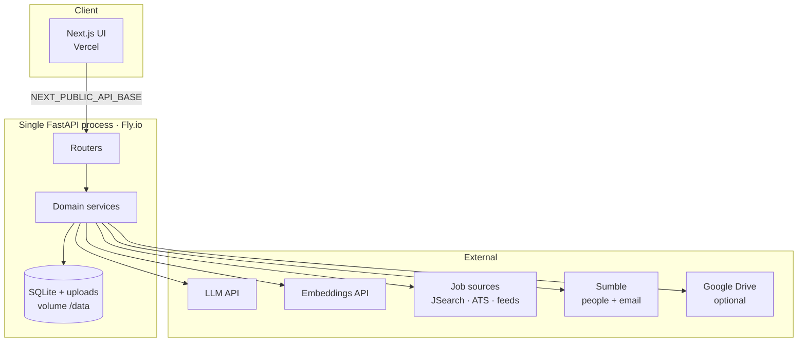
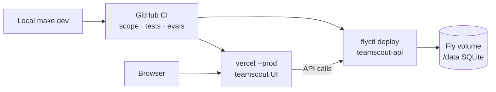
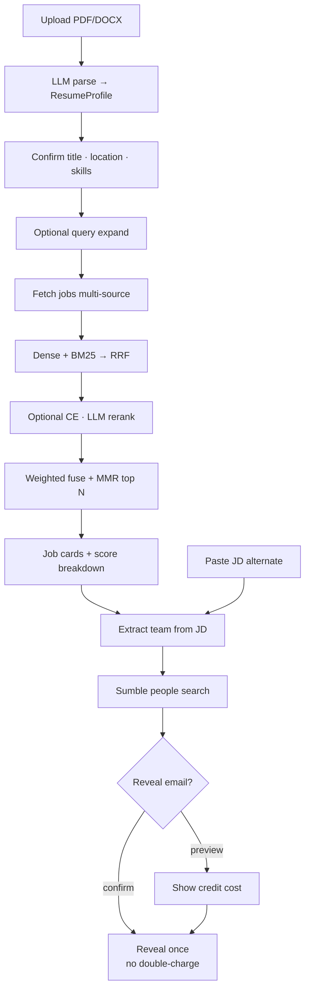
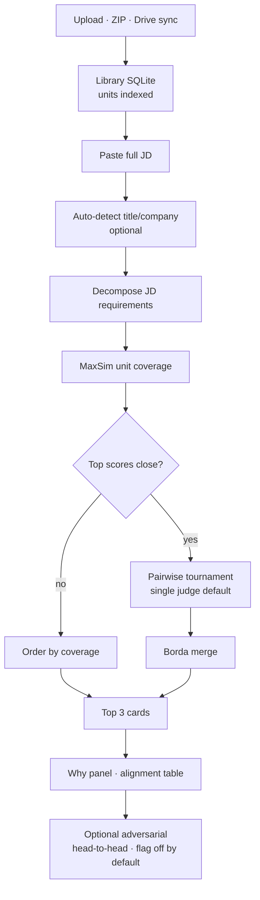
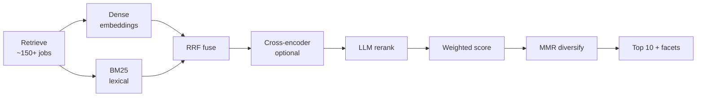
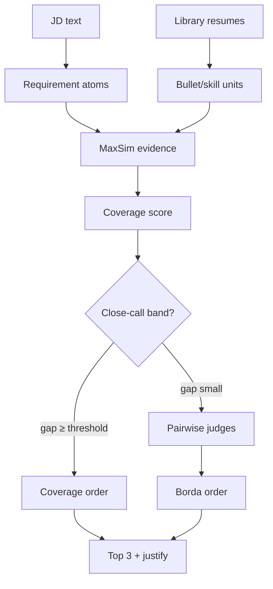
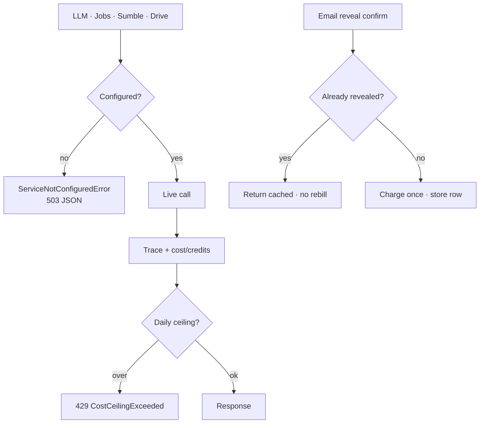
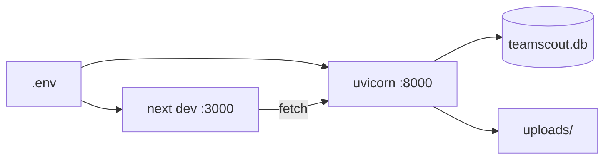

# TeamScout

[](https://github.com/kanavgoyal781/teamscout/actions/workflows/ci.yml)

**Recruiting intelligence for two jobs only:**

1. **Feature 1** — one resume → ranked live jobs → hiring team (+ optional email reveal)  
2. **Feature 2** — resume library → paste a JD → best-fit resumes (coverage + close-call tournament)

Production-hardened (CI, scope gates, rate limits, request IDs, cost ceilings) without platform sprawl. Deep notes: [docs/ARCHITECTURE.md](./docs/ARCHITECTURE.md) · [CONSTRAINTS.md](./CONSTRAINTS.md).

---

## Live demo

| Surface | URL |
|---|---|
| **Frontend (Vercel)** | **https://teamscout-opal.vercel.app/** |
| **API (Fly.io)** | **https://teamscout-api.fly.dev** |
| Health | https://teamscout-api.fly.dev/health |
| Liveness | https://teamscout-api.fly.dev/livez |

```bash
DEMO_API_BASE=https://teamscout-api.fly.dev make demo-check
```

Deploy / secrets / rollback: **[docs/DEPLOYMENT.md](./docs/DEPLOYMENT.md)**.

---

## How the system fits together



**One browser app · one API process · one SQLite file.** No queues, microservices, or remote vector DB.

### Deploy path



---

## Product flows

### Feature 1 — Resume → jobs → hiring team

Upload a resume, confirm the profile, search the live market, then (per job) extract hiring titles and look up people. Email reveal is gated and never double-charged.



**Local walkthrough**

1. Open http://localhost:3000 → **Feature 1**  
2. Upload `samples/sample_resume.pdf` → confirm profile → **Search jobs**  
3. Open **Why this match** on a card  
4. **Find the team** → extract → confirm → optional email reveal  
5. Or use **Paste a job → extract hiring team** (no job board)

---

### Feature 2 — Library → best resume for a JD

Load many resumes, paste a full posting, get a ranked top-3 with evidence and an optional close-call tournament.



**Local walkthrough**

1. Open http://localhost:3000/library  
2. Upload several resumes (or ZIP / Drive)  
3. Paste a real JD → **Find best resume for this job**  
4. Review score ring, one quiet metadata line, **Why this match**, alignment matrix  

---

### Job ranking funnel (Feature 1)



Weights and ceilings live in env / `docs/ARCHITECTURE.md`. Fail loud if LLM or embeddings are missing — no silent fake ranks.

### Resume-pick ranking (Feature 2)



Panel multi-model judging and adversarial critique are **opt-in** (`JUDGE_PANEL_MODELS`, `ADVERSARIAL_CRITIQUE`); single-judge remains default until evals show a flip-rate win.

---

## Honesty & credit safety



- No mocks in app code · no silent fallbacks  
- Health banner when integrations are missing  
- Scope gate: `make check-scope` / `scripts/check_scope.py`

---

## Local development

### Prerequisites

- Python **3.12+**
- Node.js **20+**
- [pnpm](https://pnpm.io/installation) **9+**

### Configure and start

```bash
cp .env.example .env
# Minimum for full demos:
#   LLM_API_KEY, LLM_API_BASE, LLM_MODEL
#   EMBEDDINGS_API_KEY, EMBEDDINGS_API, EMBEDDINGS_MODEL
#   JOBS_API_KEY
#   SUMBLE_API_KEY
# UI → API:
#   ALLOWED_ORIGINS=http://localhost:3000
#   NEXT_PUBLIC_API_BASE=http://localhost:8000

make install
make dev
```

| Service | URL |
|---|---|
| UI | http://localhost:3000 |
| API | http://localhost:8000 |
| Health | http://localhost:8000/health |



### Docker (production-style local)

```bash
cp .env.example .env   # fill keys
docker compose up --build
```

API :8000 · UI :3000 · SQLite/uploads in named volumes.

### Google Drive (optional)

1. Enable Drive API; set `GOOGLE_DRIVE_API_KEY` (restrict key to Drive API only)  
2. Folder shared **Anyone with the link** (viewer)  
3. Library → paste folder URL → **Sync Drive folder**  
4. Native Docs/Sheets are skipped (export PDF first). Unconfigured Drive → clear 503.

---

## Public deploy (Fly + Vercel)

| Piece | Where |
|---|---|
| Frontend | https://teamscout-opal.vercel.app/ |
| API | https://teamscout-api.fly.dev (`fly.toml` → `teamscout-api`) |
| Runbook | [docs/DEPLOYMENT.md](./docs/DEPLOYMENT.md) |

```bash
make deploy-status   # status only
make deploy-api      # flyctl deploy
make deploy-web      # vercel --prod
```

- Fly: `ALLOWED_ORIGINS=https://teamscout-opal.vercel.app`  
- Vercel: `NEXT_PUBLIC_API_BASE=https://teamscout-api.fly.dev` (build-time)

---

## Repository layout

```text
backend/app/          FastAPI
  api/routers/        HTTP
  services/           ranking · jobs_svc · team · resume · inference · library · ops · feedback
  schemas/ db/ core/ prompts/
frontend/
  app/                /  /library  /about
  components/         feature1 · feature2 · layout · about · ui · tour
  hooks/ lib/ e2e/
docs/                 ARCHITECTURE · DEPLOYMENT · CODEBASE · DEMO · SPEC
scripts/              check_scope · evals · smoke · demo_check
evals/ samples/ configs/
```

---

## API surface (summary)

| Area | Endpoints |
|---|---|
| Health | `GET /health`, `GET /livez` |
| Feature 1 | `POST /resumes/upload`, `PUT /resumes/{id}/confirm`, `POST /searches` |
| Team | `POST /jobs/from-text`, `…/extract-team`, `…/find-team`, `GET …/team`, `POST /contacts/{id}/reveal-email` |
| Feature 2 | `POST /library/upload`, `POST /library/drive/sync`, `GET /library/resumes`, `POST /library/recommend-from-jd` |
| Ops | `GET /ops`, `GET /ops/json` (token-gated) |

---

## Development commands

```bash
make test
python3 scripts/check_scope.py
cd backend && pytest -q
cd frontend && pnpm typecheck && pnpm test
cd frontend && pnpm test:e2e          # screenshots + craft assertions
python scripts/eval_ranking.py
python scripts/eval_resume_pick.py    # includes judge-stability bookkeeping
python scripts/smoke_sumble.py
```

---

## UI screenshots

Light mode is the default **cream + navy** editorial theme (dark variants as `*-dark.png`).

| Screen | Path |
|---|---|
| Wizard upload | `frontend/public/screenshots/01-wizard-upload.png` |
| Profile confirm | `frontend/public/screenshots/02-profile-confirm.png` |
| Job matches (why open) | `frontend/public/screenshots/03-job-matches.png` |
| Team discovery | `frontend/public/screenshots/04-team-discovery.png` |
| Resume library | `frontend/public/screenshots/05-library.png` |
| Top-3 comparison | `frontend/public/screenshots/06-resume-comparison.png` |
| About | `frontend/public/screenshots/07-about.png` |
| Paste-JD detecting | `frontend/public/screenshots/08-paste-jd-detecting.png` |
| Ops dashboard | `frontend/public/screenshots/09-ops.png` |


Refresh via Playwright:

```bash
cd frontend && pnpm test:e2e
```

---

## Stack

| Layer | Choice |
|---|---|
| Backend | FastAPI · Python 3.12 · Pydantic v2 |
| Frontend | Next.js · pnpm · Tailwind · React Query |
| Database | SQLite (SQLAlchemy) |
| Ranking | In-process dense + BM25 + RRF + LLM |
| Deploy | Fly.io (API) + Vercel (UI) |
| Secrets | Repo-root `.env` / platform secrets only |

---

## What we deliberately refuse

- Kubernetes, Terraform-as-product, Kafka/queues, microservices, feature stores  
- Silent LLM/job/Sumble fallbacks or mocks in app code  
- Third product surfaces (outreach send, full ATS) beyond beta stubs  

Contract: **[CONSTRAINTS.md](./CONSTRAINTS.md)** · enforced by **`make check-scope`**.

---

## Docs

| Doc | Purpose |
|---|---|
| [docs/ARCHITECTURE.md](./docs/ARCHITECTURE.md) | Funnel math, credits, SQLite, M24 judge panel |
| [docs/DEPLOYMENT.md](./docs/DEPLOYMENT.md) | Zero → live Fly + Vercel |
| [docs/DEMO.md](./docs/DEMO.md) | Timed demo script |
| [docs/CODEBASE.md](./docs/CODEBASE.md) | Deep map of packages |
| [docs/SPEC.md](./docs/SPEC.md) | Product spec history |
| [AGENTS.md](./AGENTS.md) | Contributor / agent rules |
