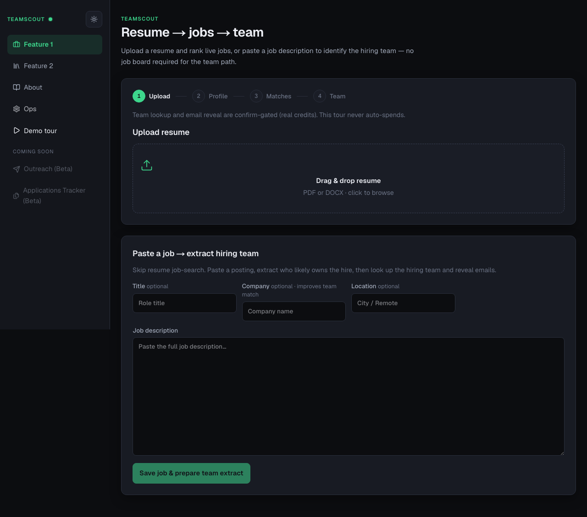
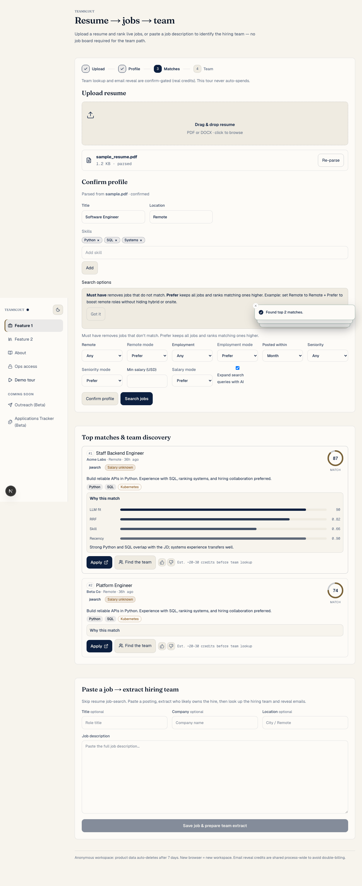
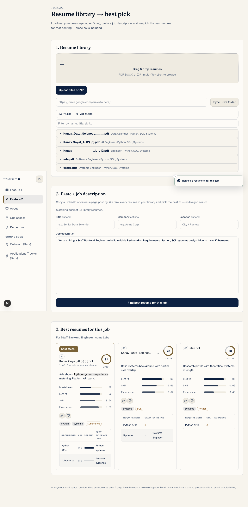

# TeamScout

[](https://github.com/kanavgoyal781/teamscout/actions/workflows/ci.yml)

Recruiting intelligence: **resume → jobs → hiring team**, and **library → best resume for a pasted JD**. Production-hardened (containers, CI, rate limits, request IDs, scope gates). Architecture: [docs/ARCHITECTURE.md](./docs/ARCHITECTURE.md).

## Live demo

| Surface | URL |
|---|---|
| **Frontend (Vercel)** | **https://teamscout-opal.vercel.app/** |
| **API (Fly.io)** | **https://teamscout-api.fly.dev** |
| Health | https://teamscout-api.fly.dev/health |
| Liveness | https://teamscout-api.fly.dev/livez |

```text
Browser → Vercel (Next.js)  --NEXT_PUBLIC_API_BASE-->  Fly.io (FastAPI :8000)
                                                         └─ SQLite volume /data
```

Deploy / secrets / rollback: **[docs/DEPLOYMENT.md](./docs/DEPLOYMENT.md)**.

```bash
DEMO_API_BASE=https://teamscout-api.fly.dev make demo-check
```

## What it does

1. **Feature 1 — Resume → jobs → team**  
   Upload a resume, rank live jobs (JSearch + free boards), extract hiring signals from the JD, look up people via Sumble, reveal emails (credit-safe, no double-charge).  
   Alternate path: paste a job description → extract team → Sumble (no job board required).

2. **Feature 2 — Library → best resume**  
   Load many resumes (upload / ZIP / optional Drive). Paste a full job description. Rank the library and pick the best fit with coverage + justification.

Beta sidebar items (Outreach, Applications Tracker) are roadmap stubs only.

## Repository layout

```text
backend/app/          FastAPI app
  api/routers/        HTTP endpoints
  services/           Domain packages: ranking, jobs_svc, team, resume,
                      inference, library, ops, feedback
                      (lazy aliases: from app.services import llm, …)
  schemas/ db/ core/ prompts/
frontend/
  app/                Next.js routes (/, /library, /about)
  components/         layout · feature1 · feature2 · email · about · ui · tour
  hooks/ lib/ e2e/
docs/                 ARCHITECTURE, DEPLOYMENT, CODEBASE, DEMO, SPEC
scripts/              check_scope, evals, smoke, demo_check
evals/ samples/ configs/
```

## Local development

### Prerequisites

- Python 3.12+
- Node.js 20+
- [pnpm](https://pnpm.io/installation) 9+

### Configure and start

```bash
cd /path/to/teamscout
cp .env.example .env
# Fill at least: LLM_API_KEY, LLM_API_BASE, EMBEDDINGS_API_KEY, EMBEDDINGS_API,
# JOBS_API_KEY, SUMBLE_API_KEY
# Production-style CORS for local UI:
# ALLOWED_ORIGINS=http://localhost:3000
# NEXT_PUBLIC_API_BASE=http://localhost:8000
make install
make dev
```

| Service | URL |
|---|---|
| UI | http://localhost:3000 |
| API | http://localhost:8000 |
| Health | http://localhost:8000/health |

### Feature 1 (local)

1. Open http://localhost:3000 (**Feature 1**)
2. Upload `samples/sample_resume.pdf`
3. Confirm title, location, skills → **Search jobs**
4. Expand **Why this match** on a card
5. **Extract team** → **Confirm & find hiring team** → optional email reveal  
   Or use **Paste a job → extract hiring team** without searching jobs

### Feature 2 (local)

1. Open http://localhost:3000/library (**Feature 2**)
2. Upload several resumes (or ZIP / Drive sync)
3. **Paste a job description** → **Find best resume for this job**
4. Review top 3: scores, coverage, justification (winner highlighted)

### Google Drive (optional)

1. Enable **Google Drive API**, set `GOOGLE_DRIVE_API_KEY` in `.env`  
   Restrict the key to the **Drive API** only in Google Cloud Console.
2. Share the folder as **Anyone with the link** (viewer) — private files 403 and are skipped per-file
3. **Native Google Docs/Sheets/Slides** are skipped with a clear reason — download as PDF and re-add
4. Library UI → paste folder URL → **Sync Drive folder**  
   Unconfigured Drive → clear 503 (no silent empty sync). API errors never echo the API key.

## Docker (production-style local)

```bash
cp .env.example .env   # fill keys
docker compose up --build
```

- API http://localhost:8000 · UI http://localhost:3000  
- SQLite + uploads in volumes `teamscout-data` / `teamscout-uploads`  
- `NEXT_PUBLIC_API_BASE=http://localhost:8000`

## Public deploy (Fly + Vercel)

| Piece | Where |
|---|---|
| Frontend | **https://teamscout-opal.vercel.app/** |
| API | **https://teamscout-api.fly.dev** (`fly.toml` app `teamscout-api`) |
| Runbook | [docs/DEPLOYMENT.md](./docs/DEPLOYMENT.md) |

```bash
make deploy-status   # CLIs + auth + status (no mutations)
make deploy-api      # flyctl deploy
make deploy-web      # vercel --prod
```

On Fly, set `ALLOWED_ORIGINS=https://teamscout-opal.vercel.app` (no trailing slash).  
On Vercel, set `NEXT_PUBLIC_API_BASE=https://teamscout-api.fly.dev` (build-time).

## Development commands

```bash
make test
python3 scripts/check_scope.py
cd backend && pytest -q
cd frontend && pnpm typecheck && pnpm test
python scripts/eval_ranking.py
python scripts/eval_resume_pick.py
python scripts/smoke_sumble.py
```

## API surface (current)

| Endpoint | Description |
|---|---|
| `GET /health` | Config presence; `ok` false if required integrations missing |
| `GET /livez` | Process liveness (deploy checks) |
| `POST /resumes/upload` | Parse PDF/DOCX → profile |
| `PUT /resumes/{id}/confirm` | Confirm profile |
| `POST /searches` | Fetch + hybrid rank top jobs |
| `POST /jobs/from-text` | Ingest pasted JD (team path without JSearch) |
| `POST /jobs/{job_id}/extract-team` | LLM team extraction |
| `POST /jobs/{job_id}/find-team` | Sumble people search |
| `GET /jobs/{job_id}/team` | Cached contacts |
| `POST /contacts/{id}/reveal-email` | Preview or confirm email reveal |
| `POST /library/upload` | Multi-file / ZIP library ingest |
| `POST /library/drive/sync` | Public Drive folder sync |
| `GET /library/resumes` | List library resumes |
| `POST /library/recommend-from-jd` | **Feature 2:** paste JD → top library resumes |
| `POST /library/jobs/{job_id}/recommend-resumes` | Recommend for a cached job id |
| `POST /library/intent/search` | Intent form → ranked jobs (secondary path) |

## Ranking (high level)

1. Fetch jobs (JSearch + optional free boards), recency filter, SQLite cache  
2. Dense embeddings + BM25 → RRF  
3. LLM rerank shortlist  
4. Weighted fuse (see `docs/ARCHITECTURE.md` for live weights / MaxSim resume pick)

## UI screenshots

Playwright e2e with mocked API (`cd frontend && pnpm test:e2e`):

| Screen | Path |
|---|---|
| Wizard upload | `frontend/public/screenshots/01-wizard-upload.png` |
| Profile confirm | `frontend/public/screenshots/02-profile-confirm.png` |
| Job matches | `frontend/public/screenshots/03-job-matches.png` |
| Team discovery | `frontend/public/screenshots/04-team-discovery.png` |
| Resume library | `frontend/public/screenshots/05-library.png` |
| Top-3 comparison | `frontend/public/screenshots/06-resume-comparison.png` |





## Stack

| Layer | Choice |
|---|---|
| Backend | FastAPI, Python 3.12, Pydantic v2 |
| Frontend | Next.js, pnpm, Tailwind, React Query |
| Database | SQLite (SQLAlchemy) |
| Deploy | Fly.io (API) + Vercel (UI) |
| Secrets | Repo-root `.env` / platform secrets only |

## Honesty / anti-bloat

- No mocks in app code; unconfigured integrations → typed 503  
- No silent LLM / jobs / Sumble fallbacks  
- Scope gate: `scripts/check_scope.py` / `make check-scope`  
- Contract: [CONSTRAINTS.md](./CONSTRAINTS.md)

Not in product: outreach send, applications tracker, queues, K8s/Terraform as product infra.

## Docs

| Doc | Purpose |
|---|---|
| [docs/ARCHITECTURE.md](./docs/ARCHITECTURE.md) | Funnel, scores, credit-safety, SQLite tradeoffs |
| [docs/DEPLOYMENT.md](./docs/DEPLOYMENT.md) | Zero → live Fly + Vercel |
| [docs/DEMO.md](./docs/DEMO.md) | Timed demo script |
| [docs/CODEBASE.md](./docs/CODEBASE.md) | Deep architecture map |
| [docs/SPEC.md](./docs/SPEC.md) | Product spec history |
| [AGENTS.md](./AGENTS.md) | Contributor / agent rules |

