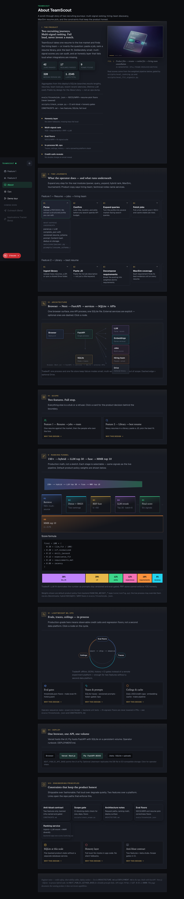

# TeamScout

[](https://github.com/kanavgoyal781/teamscout/actions/workflows/ci.yml)

Recruiting intelligence for a single operator: parse one resume, rank live job postings with a transparent multi-signal score, then extract a hiring team and optionally reveal emails; or load a resume library, paste a JD, and pick the best resume via MaxSim coverage (not hybrid RRF) with an optional close-call tournament. FastAPI + Next.js + SQLite; external calls fail closed when unconfigured. See [ARCHITECTURE.md](./ARCHITECTURE.md) and [CONSTRAINTS.md](./CONSTRAINTS.md).



## Features

**Feature 1 — Resume → jobs → hiring team.** Upload a PDF/DOCX (`POST /resumes/upload`), confirm the parsed profile, search (`POST /searches`) for a hybrid-ranked top 10 with per-card **Why this match** score breakdown (LLM fit, RRF, skill, experience, requirements, recency), then on a job: **Find the team** → extract hiring-team signals from the JD → **Confirm & find hiring team** → **Reveal email — preview cost** (`POST /jobs/{id}/extract-team`, `find-team`, `POST /contacts/{id}/reveal-email`). Product copy says “hiring team”; Sumble is the backend people/email provider.

**Feature 2 — Resume library → best resume.** Upload many PDF/DOCX/ZIP files (or optional public Drive sync) into a content-hash-deduped library, paste a full job description, and rank library resumes with JD requirement decomposition + MaxSim unit coverage, optional close-call pairwise tournament, and a top-3 comparison showing **Coverage** % vs **Overall match** (`POST /library/upload`, `POST /library/recommend-from-jd`). When coverage scores are close and the tournament reorders the list, the UI shows a **Ranked by close-call tournament** badge. This path does not run the Feature 1 job-board search.

## Eval metrics

Latest recorded run per suite from [`evals/history.jsonl`](./evals/history.jsonl) (append-only; regenerate with `make eval` / `make eval-fit` / `python3 scripts/eval_resume_pick.py` / `python3 scripts/experiment.py`). Threshold floors live in [`evals/thresholds.json`](./evals/thresholds.json). Trends: `make eval-report`.

| Suite | Metric | Latest value | Recorded (UTC) | `git_sha` |
|---|---|---:|---|---|
| `ranking` | hybrid NDCG@10 | **0.9917** | 2026-07-09 | `b27a953` |
| `ranking` | hybrid MRR | **1.0000** | 2026-07-09 | `b27a953` |
| `ranking` | dense NDCG@10 | **0.9848** | 2026-07-09 | `b27a953` |
| `fit_signals` | experience order accuracy | **0.980** | 2026-07-09 | — |
| `fit_signals` | requirements order accuracy | **1.000** | 2026-07-09 | — |
| `fit_signals` | overqualified penalty rate | **1.000** | 2026-07-09 | — |
| `resume_pick` | win rate (MaxSim path) | **1.000** (8/8) | 2026-07-09 | `b27a953` |
| `resume_pick` | whole-doc baseline win rate | **0.875** (7/8) | 2026-07-09 | `b27a953` |
| `diversity` | MMR companies @ top 10 | **9** (rel-only: 3) | 2026-07-09 | `b27a953` |
| `diversity` | MMR NDCG@10 drop vs rel-only | **0.0175** | 2026-07-09 | `b27a953` |
| `feedback` | labeled pairs / score separation (ordered fixture) | 30 / **+46.0** | 2026-07-10 | `6125b8d` |
| `experiment:defaults` | hybrid NDCG@10 (config A/B) | **0.9920** | 2026-07-10 | `b27a953` |
| Live Sumble E2E | people + reveal smoke | *placeholder — not written to history.jsonl; use `python3 scripts/smoke_sumble.py` when `SUMBLE_API_KEY` is set* | — | — |
| Public deploy gate | `make demo-check` | *placeholder — requires `DEMO_API_BASE` pointing at a deployed API; local health is `GET /health`* | — | — |

Models on the ranking / resume_pick / diversity rows above: LLM `MiniMaxAI/MiniMax-M2.5`, embeddings `BAAI/bge-m3` (from the history record). Latest `feedback` ordered-fixture row used model `gpt-4o-mini` at sha `6125b8d`. These are fixture/eval numbers, not production traffic quality guarantees. History also logs inverted feedback control batches (negative separation) for gate checks — not used as the headline metric above.

```bash
make eval-report   # trend dump from history.jsonl
```

## Screenshots

Playwright e2e artifacts under [`frontend/public/screenshots/`](./frontend/public/screenshots/) (`cd frontend && pnpm test:e2e`). Route-mocked API — not live production captures. Relative paths so they render on GitHub. `06-resume-comparison.png` is regenerated with the Feature 2 fixture that sets `tournament_ran` / `overrode_coverage` so **Ranked by close-call tournament**, **Coverage**, and **Overall match** are visible; live demos only show the badge when coverage scores are close enough for an override.

| What | File |
|---|---|
| About | [`07-about.png`](./frontend/public/screenshots/07-about.png) |
| Job match card with **Why this match** score breakdown open | [`03-job-matches.png`](./frontend/public/screenshots/03-job-matches.png) |
| Resume comparison (Coverage / Overall match + tournament badge when override runs) | [`06-resume-comparison.png`](./frontend/public/screenshots/06-resume-comparison.png) |


Additional frames (upload, confirm, team panel, library ingest): `01`–`05` in the same directory.

## Live URLs

This repo ships deploy config + CI + `make demo-check`. A public URL exists only after an operator deploys (see [DEPLOYMENT.md](./DEPLOYMENT.md)). Do not treat the names below as always-up SLAs.

| Surface | URL | How to verify |
|---|---|---|
| Local UI | http://localhost:3000 | `make dev` |
| Local API | http://localhost:8000 | `curl -s localhost:8000/health` → `ok: true` for required checks |
| Deployed API (Fly app name in `fly.toml`) | `https://teamscout-api.fly.dev` | `DEMO_API_BASE=https://teamscout-api.fly.dev make demo-check` |
| Deployed UI (Vercel) | *operator-linked project; set `NEXT_PUBLIC_API_BASE` to the Fly origin* | `make deploy-status` |

Operator-owned: run `make deploy-status` and `demo-check` before claiming a public URL in a pitch. Config-only PRs do not imply a live deployment.

## 5-minute quickstart

```bash
# Prerequisites: Python 3.12+, Node 20+, pnpm 9+
cp .env.example .env
# Required for full Feature 1: LLM_API_KEY, EMBEDDINGS_API_KEY, JOBS_API_KEY, SUMBLE_API_KEY
# (and matching *_API_BASE / model names). Unconfigured services return typed 503 JSON — no silent mocks.
make install
make dev
# Backend http://localhost:8000  ·  Frontend http://localhost:3000
curl -s http://localhost:8000/health | python3 -m json.tool
```

1. Open http://localhost:3000 (sidebar **Feature 1** / “Resume → Jobs → Team”).
2. Upload [`samples/sample_resume.pdf`](./samples/sample_resume.pdf) → **Upload & parse** → **Confirm profile** → **Search jobs**.
3. Expand **Why this match** on a card; optional **Find the team** → **Extract team from description** → **Confirm & find hiring team** → **Reveal email — preview cost** (confirm only if credits allow).
4. Sidebar **Feature 2** → **Upload files or ZIP** (≥1 distinct PDF) → paste a JD → **Find best resume for this job**. Look for **Coverage** % vs **Overall match**; if scores were close and reordered, the **Ranked by close-call tournament** badge appears.

Timed walkthrough: [DEMO.md](./DEMO.md).

## Stack & docs

| Layer | Choice |
|---|---|
| Backend | FastAPI, Python 3.12, Pydantic v2 |
| Frontend | Next.js, pnpm, Tailwind |
| Database | SQLite via SQLAlchemy (no Postgres required) |
| Ranking | In-process dense + BM25 + RRF + LLM rerank; MaxSim + optional tournament for resume pick |
| Secrets | Repo-root `.env` only |

- [ARCHITECTURE.md](./ARCHITECTURE.md) — request paths, ranking funnel, credit-safety
- [CONSTRAINTS.md](./CONSTRAINTS.md) — anti-bloat / honesty contract (`make check-scope`)
- [DEPLOYMENT.md](./DEPLOYMENT.md) — Fly + Vercel operator runbook
- [AGENTS.md](./AGENTS.md) — contributor product bounds

## Development gates

```bash
make check-scope           # anti-bloat
make test                  # backend pytest + frontend unit
make pipeline-offline      # scope + unit + fit_signals
make pipeline              # + ranking/resume_pick when embeddings configured; + demo-check if DEMO_API_BASE set
make eval-report
python3 scripts/smoke_sumble.py   # when SUMBLE_API_KEY set
```

## Not in product scope

Outreach automation, applications tracker, multi-tenant auth, Kubernetes/Terraform/Kafka/feature stores. Beta sidebar tabs are disabled stubs (“Coming soon”).
