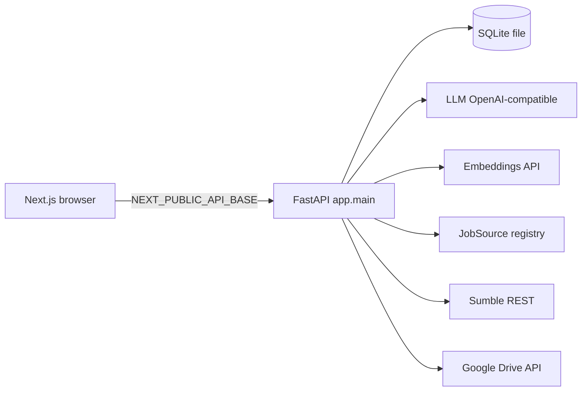

# TeamScout Architecture

One-page engineer notes. Claims match the code under `backend/app`.

## System diagram



Single process API + single Next frontend. No message bus, no remote vector DB, no multi-service mesh.

**Deploy topology (public):** Browser → Vercel (Next.js) → Fly.io (FastAPI :8000) with SQLite + uploads on volume `/data`. Optional Litestream → S3-compatible bucket. Details: `docs/DEPLOYMENT.md`.

## Request path (Feature 1)

```text
Upload PDF/DOCX
  → parser (LLM complete_json, prompt resume_schema)
  → confirm profile fields
  → optional LLM query expand (3–5 variants) + SearchParams must-have (hard) / prefer (soft) filters
  → multi-source job fetch via provider registry (JSearch + free ATS boards + remote feeds + optional Adzuna)
  → annotate + hard filters + exact/embedding dedupe (prefer direct_ats)
  → dense + BM25 → RRF
  → optional cross-encoder (RRF top 50 → CE → top 15; flag RANKING_USE_CROSS_ENCODER, default off until experiment win)
  → LLM rerank (pointwise default; listwise when RANKING_LLM_LISTWISE) → weighted fuse
  → Prefer (soft) preference boosts → MMR diversify + company soft-cap
  → top SEARCH_RESULTS_TOP_N (default 10) with score_breakdown, facets, dropped_counts
  → team extract (prompt team_extract) → Sumble find → email reveal
```

Feature 2 inverts ranking: library resumes are candidates; JD is the query
(`resume_ranking`: MaxSim unit coverage + optional close-call pairwise tournament).

## Retrieve → rank funnel

**Jobs (resume search / intent search)** — `app.services.jobs` + `job_sources` + `job_filters` + `ranking` + `hybrid_rank` + `ranking_math`:

1. **Retrieve (provider registry):** When `use_expand` (default true), LLM expands the profile into 3–5 query variants (`query_expand`). Otherwise `build_jsearch_queries`. `job_sources.registry` fans out (concurrency 4) to enabled adapters: **JSearch** (key required), **Greenhouse/Lever/Ashby** board APIs (keyless; slugs in `configs/ats_companies.json`; 6h board cache in `jobs_cache`), **Remotive/RemoteOK** feeds when `remote_mode` is `remote` or `any`, optional **Adzuna** when `ADZUNA_APP_ID`/`ADZUNA_APP_KEY` set. Each call traced as `op=source.<name>`. **One failing source never kills search** — errors counted in `per_source_counts` / `source_errors`. **No HTML scraping** — official public APIs only. ATS boards return full postings; **post-fetch filter** applies title keywords (incl. expansion terms), location/remote, and recency before merge.
2. **Normalize / filter / dedupe:** Require title, description, apply URL. Annotate seniority / remote / employment / salary; set `source` + `source_quality` (`direct_ats` | `aggregator` | `feed`). **Hard** prefs exclude known mismatches (unknown kept). Recency uses `SearchParams.date_window`. Exact + optional embedding near-dup merge (`job_dedup`) **prefers direct_ats over aggregator/feed** on collision. Soft rank boost for `direct_ats` only via experiment `direct_ats_boost` (default 0). Cache in SQLite `jobs_cache` with stable `job_id`. Response includes `dropped_counts`, `per_source_counts`, source facets, and **facet buckets over the filtered fetch pool** (not the ranked top-N).
3. **Dense rank:** embed query + candidates (`embeddings`), cosine similarity order (vectors L2-normalized so dot product = cosine). Content-hash cache in `embedding_cache`.
4. **Lexical rank:** BM25 over tokenized title/skills/description (`rank_bm25`).
5. **RRF merge:** for 0-based index `i` in each ranking, add `1 / (RRF_K + i + 1)`; `RRF_K` default 60; then min-max normalize → `rrf_normalized` ∈ [0,1].
6. **Cross-encoder (optional, experiment-gated):** when `RANKING_USE_CROSS_ENCODER`, take RRF top `CROSS_ENCODER_POOL` (50) → DeepInfra `POST .../v1/inference/{RERANKER_MODEL}` with `{"queries":[q],"documents":[...]}` in **one** request (`op=cross_encode`, reuses `EMBEDDINGS_API_KEY`) → raw scores **min-max normalized per slate** before fusion → top `LLM_RERANK_TOP_N` (15) advance to LLM. Default **off** until a recorded experiment beats baselines; `RANKING_WEIGHT_CROSS_ENCODER` default 0.0 (rebalance only via experiment JSON).
7. **LLM rerank:**
   - **Pointwise (default):** prompt `rerank_pointwise` v3 on top shortlist; batched (`_RERANK_BATCH_SIZE = 6`); omitted ids → explicit heuristic fill.
   - **Listwise (`RANKING_LLM_LISTWISE`):** prompt `rerank` v4 — single call returns a true permutation of short aliases + one-line reason; invalid permutation retries once; position → 0–100 fit for fusion; skills chips stay heuristic so net token budget does not increase vs legacy pointwise cascade.
8. **Fuse** (`fuse_final_score`), returned as 0–100. Defaults from `RANKING_WEIGHT_*` in `app/core/config.py` (must sum to ~1.0 via `validate_ranking_weights` at startup; includes optional `cross_encoder` weight):

```
final = 100 * (
  RANKING_WEIGHT_LLM          * (llm_fit / 100)   # default 0.38
+ RANKING_WEIGHT_RRF          * rrf_normalized    # default 0.20
+ RANKING_WEIGHT_SKILLS       * skill_jaccard     # default 0.12
+ RANKING_WEIGHT_EXPERIENCE   * experience_fit    # default 0.12
+ RANKING_WEIGHT_REQUIREMENTS * requirements_met  # default 0.10  (token-aware; no substring FP)
+ RANKING_WEIGHT_RECENCY      * recency_half_life # default 0.08
+ RANKING_WEIGHT_CROSS_ENCODER * ce_normalized    # default 0.00 until experiment
)
```

Soft prefs add up to +5 pts each (clamped to 100) via `soft_boost_score`. Then MMR (λ=0.75, relevance normalized to unit scale) + company soft-cap (max 3 in top 10 when ≥10 companies) when embeddings are configured.

Top `SEARCH_RESULTS_TOP_N` (default 10) returned with transparent `score_breakdown` (includes `soft_boost`, `cross_encoder`, optional `match_likelihood`).

### Learned weights + calibration (human-gated)

- `scripts/fit_weights.py`: **pure-Python** logistic GD (stdlib only; no numpy) on feedback component vectors; continuous features **z-scored with train-split stats only**; softplus maps coefs → **non-negative** fusion weights (intentional product constraint). **`shown_rank` is a bias-control covariate only** (not a fusion weight). Refuses below 30 labels. Writes **`configs/experiments/learned_weights.json` only** — never mutates live settings/`defaults.json`.
- Same script fits **Platt scaling** (`services/calibration.py`) into SQLite `score_calibration` (a, b, n_labels, holdout AUC). Fitting is explicit-script only. **UI match likelihood stays off** until a human sets `RANKING_USE_CALIBRATION=true` **and** the stored fit has `n_labels ≥ 50` — no silent auto-apply from a fit run alone. When on, the ScoreRing keeps **raw score primary** and shows likelihood as a secondary label.
- Listwise why-panels intentionally use **listwise one-line reasons + heuristic skill chips** (no second pointwise explain pass) so net LLM tokens do not exceed the legacy pointwise cascade. Listwise failure falls back to **retrieval order + heuristic** (no full pointwise LLM cascade). When `RANKING_LLM_LISTWISE`, the LLM shortlist is clamped to `LLM_RERANK_TOP_N` (15).
- CE shortlist shrink (RRF top-50 → top-15 for LLM) applies only when `RANKING_USE_CROSS_ENCODER` and (`RANKING_WEIGHT_CROSS_ENCODER > 0` or `CROSS_ENCODER_SHORTLIST=true`). Flag-on with weight 0 does not silently change the LLM pool. CE cost is estimated with the embeddings $/1M rate as an intentional approximation (same DeepInfra token meter).
- Promotion path: proposal → `scripts/experiment.py` → `evals/experiments.jsonl` → human flip of env/defaults with recorded NDCG@10/MRR.

**Resume pick** — `resume_ranking` + `ranking_math_align` + `jd_decompose` + `pairwise_tournament`:

1. Decompose JD into atomic requirements (LLM when enabled; deterministic skills/phrases when `use_llm=False`).
2. Extract resume units (bullets/skills); MaxSim evidence per requirement (cosine + token-aware lexical floor + one skill-list bonus).
3. Weighted coverage score; near-dup clustering of library resumes.
4. Optional close-call pairwise tournament when top-2 gap &lt; 0.05 (Borda; cache keyed by JD hash + prompt version + order-normalized resume hashes).
5. Optional LLM justification citing evidence units. Recency is zeroed on resume cards; match_score is primarily coverage × 100.

## Lightweight ML ops (what we mean)

Not Kubernetes, MLflow-as-product, feature stores, or model registries. In this repo:

| Piece | Where |
|---|---|
| Versioned prompts | `backend/app/prompts/*.md` (YAML frontmatter name/version) |
| Traces | SQLite `traces` via `observability`; optional OTLP |
| Embedding cache | SQLite `embedding_cache` |
| Cost ceilings | `LLM_DAILY_COST_CEILING_USD`, `SUMBLE_DAILY_CREDIT_CEILING` → 429 fail-closed |
| Eval floors | `evals/thresholds.json` (enforced by scripts + `check_scope`) |
| Eval history | `evals/history.jsonl` (append from eval scripts) |
| Trend report | `scripts/eval_report.py` / `make eval-report` |
| Offline fit suite | `scripts/eval_fit_signals.py` / `make eval-fit` |
| Hybrid ranking eval | `scripts/eval_ranking.py` / `make eval` |
| Resume-pick eval | `scripts/eval_resume_pick.py` |
| Pipeline gate | `scripts/pipeline_check.py` / `make pipeline` |
| Ops UI | `GET /ops`, `GET /ops/json` behind `OPS_TOKEN` |

## Credit-safety (Sumble)

- `sumble_client.post(..., credit_costing=True)` logs redacted URL at INFO before the call and credits used/remaining after.
- Email reveal: SQLite `email_reveals` rows; confirm path uses a transaction so a successful reveal is not double-charged on retry (`email_reveal`).
- Unconfigured Sumble raises `ServiceNotConfiguredError` (503 JSON) — no invented contacts.

## Error-handling philosophy

- Fail loud: missing LLM / embeddings / jobs / Sumble config → typed `ServiceNotConfiguredError`; HTTP failures → `ServiceFailingError`.
- No silent fallbacks or mock data importable from `backend/app`.
- Global handler (`exception_handlers.unhandled_exception_handler`) returns generic `internal_error` to clients; full exception logged server-side with `request_id`.
- Rate limits (slowapi) and 10 MiB upload cap return structured JSON errors without stack traces.

## Why SQLite at this scale

- One operator, one deploy, file-backed state for resumes, job cache, contacts, email reveals, traces, embedding cache.
- No ops tax of a separate database service; Fly volume mounts `/data` for persistence.
- Ranking and enrichment are request-scoped HTTP + in-process math — not a multi-writer analytics warehouse.

## Observability

- **Traces:** every LLM, embeddings, Sumble, and JSearch outbound call is instrumented via `app.services.observability` into SQLite `traces` (request_id from contextvars, operation, model, prompt name/version/hash, tokens, latency_ms, cost_usd, credits_used, status, error_type, cache_hit). **Trace writes are best-effort** (SQLite write failure is logged and does not fail the user request); **ceiling checks fail closed** on read/sum errors. Optional OTLP/HTTP JSON export when `OTEL_EXPORTER_OTLP_ENDPOINT` is set (best-effort; SQLite works with zero extra infra).
- **Ops dashboard:** `GET /ops` (HTML) and `GET /ops/json` behind `OPS_TOKEN`. Prefer `Authorization: Bearer` or `X-Ops-Token` (query `?token=` is local-dev only — can leak via logs/history/Referer). Missing `OPS_TOKEN` or wrong/missing token → 401 (not bypassable). Numbers tables only (no charting library): last 100 traces, p50/p95 latency, cost today, cost per feature-1/2 run, error rates, embedding cache hit-rate, ceilings.
- **Prompt registry:** versioned Markdown under `backend/app/prompts/*.md` with YAML frontmatter (`name`, `version`, optional `system` / `max_tokens`). Loader returns body + content hash; LLM traces store prompt metadata.
- **Embedding cache:** SQLite `embedding_cache` keyed by sha256(model + text); `embed` / `embed_batch` check cache first.
- **Cost guardrails:** daily LLM USD ceiling (`LLM_DAILY_COST_CEILING_USD`, default $5) and Sumble credit ceiling (`SUMBLE_DAILY_CREDIT_CEILING`) fail closed with `CostCeilingExceededError` (HTTP 429). Ceiling-check DB failures also deny.
- **Eval history:** `scripts/eval_ranking.py`, `scripts/eval_resume_pick.py`, and `scripts/eval_fit_signals.py` append metrics (+ prompt versions / model / git SHA where applicable) to `evals/history.jsonl`. `scripts/eval_report.py` prints trends. CI always runs the offline fit-signal suite and always attempts to upload `evals/history.jsonl` as an artifact (`if-no-files-found: ignore`); ranking/resume-pick history lines appear only when embeddings secrets are configured.
- **Prompt / model changes:** any change to prompts under `backend/app/prompts/` or to `LLM_MODEL` / `EMBEDDINGS_MODEL` requires a green eval run (ranking + resume-pick floors) before merge when secrets are available; floors remain enforced by `check_scope` / `evals/thresholds.json`.

### SQLite product tables (observability subset)

| Table | Purpose | Key columns |
|---|---|---|
| `traces` | Outbound call telemetry | `id`, `request_id`, `operation`, `model`, `prompt_name`, `prompt_version`, `prompt_hash`, `input_tokens`, `output_tokens`, `latency_ms`, `cost_usd`, `credits_used`, `status`, `error_type`, `cache_hit`, `created_at` |
| `embedding_cache` | Cached embedding vectors | `id`, `content_hash` (unique), `model`, `embedding_json`, `created_at` |
| `query_expansion_cache` | LLM query expand variants | `id`, `content_hash`, `prompt_version`, `expansions_json`, `created_at` |
| `resume_units` | MaxSim unit index | `id`, `resume_id`, `unit_text`, `section`, `unit_hash`, `embedding_json`, `created_at` |
| `jd_requirements_cache` | JD → atomic requirements | `id`, `content_hash`, `prompt_version`, `requirements_json`, `created_at` |
| `pairwise_judge_cache` | Tournament judgments | `id`, `cache_key`, `jd_hash`, `hash_a`, `hash_b`, `winner_hash`, `reason`, `created_at` |

Other product tables (`resumes`, `jobs_cache`, `searches`, `contacts`, `email_reveals`, library tables, etc.) are defined in `backend/app/db/models.py` — see model source for the full column set; do not invent columns here.

## Production surface

| Concern | Implementation |
|---|---|
| Request ID | `RequestIdMiddleware` → `X-Request-ID` + structlog contextvars |
| Logging | JSON when `ENV=prod` (or non-TTY); console pretty in local TTY dev |
| Rate limits | slowapi on upload / search / find-team / reveal-email / extract-team / recommend-resumes (keyed on direct peer IP — compose/single-host; do not trust X-Forwarded-For without a known proxy hop) |
| CORS | `ALLOWED_ORIGINS` or `CORS_ORIGINS`; wildcard rejected in prod |
| Timeouts | `http_timeouts` used by llm, embeddings, jobs, sumble_client, drive |
| Health | config-presence checks + `version` (`APP_VERSION` / `GIT_SHA`); `/livez` process liveness |
| Traces / ops | SQLite `traces` + token-gated `/ops`; optional OTLP |
| Cost ceilings | LLM daily USD + Sumble daily credits → 429 fail closed |
| Pipeline gate | `make pipeline` → `scripts/pipeline_check.py` |
| Deploy | local: `Dockerfile.backend` / `Dockerfile.frontend` / `docker-compose.yml`; public: `fly.toml` + Vercel (`docs/DEPLOYMENT.md`); wrappers: `make deploy-api` / `make deploy-web` / `make deploy-status` |

### Rate-limit keying

Limits use `slowapi.util.get_remote_address` (direct TCP peer). Correct for compose-direct and single-host deploy. Behind a reverse proxy without PROXY protocol, all clients share one IP — introduce a trusted-hop key function only when the proxy is known; never blindly trust client-supplied `X-Forwarded-For`.

## Learning loop

Observe → label → experiment → gate → deploy. **Never auto-mutates production ranking weights or prompts.**

```text
usage (UI)
  → feedback rows (POST /feedback → SQLite `feedback`)
  → scripts/build_eval_from_feedback.py → evals/feedback_set.jsonl  (operator export; needs DB access)
  → scripts/eval_ranking.py --suite feedback  (≥30 labels or exit 0 loudly)
  → scripts/experiment.py --variants configs/experiments/*.json
       → evals/experiments.jsonl (config_hash + git_sha)
  → threshold gates (evals/thresholds.json + weekly-eval workflow)
  → human deploy (no auto weight/prompt ship)
```

| Stage | What | Where |
|---|---|---|
| Capture | Thumbs up/down on job cards + resume picks; implicit apply / find-team clicks | Frontend `FeedbackButtons`; `POST /feedback` |
| Store | kind, target ids, profile/jd hash, score_shown, **shown_rank**, **score_components**, prompt_versions, model, ranking_config_hash, git_sha, ts | SQLite `feedback` (no extra PII) |
| Weight proposal | Logistic GD on component vectors + rank covariate; never live-mutates | `scripts/fit_weights.py` → `configs/experiments/learned_weights.json` |
| Calibration | Platt a,b in SQLite; UI likelihood only if n≥50 | `services/calibration.py` / `score_calibration` table |
| Eval set | thumbs_up=relevant, thumbs_down=irrelevant, apply_click=strong positive (+ provenance) | `evals/feedback_set.jsonl` (built offline from DB) |
| Feedback suite | **Label volume + mean score_shown separation** between historical positives/negatives — *not* offline re-rank NDCG until pairs can be rehydrated | `eval_ranking.py --suite feedback` |
| Experiments | Offline: weights/rrf/recency/rerank via settings; `use_mmr`/`mmr_lambda` via diversity (and persona diversify when embeddings on). `expansion`/`tournament_threshold` hashed for provenance (LLM paths; not exercised offline). | `configs/experiments/*.json` → `scripts/experiment.py` |
| Scheduled | Weekly cron: synthetic + feedback health check + optional smoke/demo; **does not pull production SQLite** or auto-build feedback_set | `.github/workflows/weekly-eval.yml` (observe-only) |
| Ops | Feedback counts, suite metrics/trends, last experiments from `EVALS_DIR` or auto-discovered `evals/` | Token-gated `GET /ops` |

**Honesty limits:** Weekly CI never exports prod feedback rows. Until feedback stores rehydratable pair content (or an ops export job with DB access builds `feedback_set.jsonl`), the feedback suite is a **diagnostic**, not a ranking regression gate. Experiment rank tables should be read with that offline measurement path in mind.

**Release rule:** no prompt or ranking-weight change ships without a green experiment run recorded under `evals/` (history and/or experiments.jsonl). The weekly workflow and experiment harness **only observe and gate** — they do not write production settings, prompts, or deploy config. Secrets never appear in logs or artifacts (metrics JSONL only).

**Ops evals path:** set `EVALS_DIR` to the directory that *contains* `evals/` (e.g. mount CI artifacts at `/data` and set `EVALS_DIR=/data`). Auto-discovery walks parents for `evals/thresholds.json` / `history.jsonl`, then tries `/app`, `/data`, and CWD.

## What we deliberately rejected

Platform sprawl (cluster orchestration, IaC-as-product, feature stores, remote model registries, queues, A/B SDKs) does not earn its place for a two-feature recruiting tool. Production-grade here means reproducible builds, CI gates, observable credit calls, eval floors, secure defaults, and one live deploy (Fly + Vercel). Auto-tuning production rankers from online feedback is also rejected — the learning loop is human-gated.

## Search prefs: Must have vs Prefer (UI)

API fields stay `hard` / `soft` (`SearchParams.*_pref`). UI labels:

- **Must have** (`hard`): drops jobs that fail the criterion.
- **Prefer** (`soft`): keeps all jobs; matching ones rank higher (soft boost points).

## Anonymous workspaces (M19)

Each browser gets an opaque `ts_workspace` cookie (`HttpOnly`; `SameSite=Lax` in dev; **`SameSite=None; Secure` in prod** so credentialed browser calls from a different site such as Vercel UI → Fly API still send the cookie). Override with `WORKSPACE_COOKIE_SAMESITE=lax|none|strict`. Alternative topology: same-site reverse proxy so Lax is enough. `/livez` and `/health` do **not** mint workspaces. Cookie `Max-Age` is re-set on every product response so TTL slides with activity. First product request without a cookie mints `secrets.token_urlsafe` and persists a `workspaces` row. Uploads live under `uploads/{workspace_id}/` so TTL cannot delete another workspace's files. All product reads/writes for resumes, resume_units, searches, intent_searches, jobs_cache (session-created), team_extractions, job_team_searches, contacts, and feedback are filtered by `workspace_id`. Direct ID probing across workspaces returns 404.

### Global-by-design exceptions

| Table / area | Scope | Notes |
|---|---|---|
| `email_reveals` | **Global** by Sumble `person_id` | Credit protection: a second workspace reuses a prior terminal reveal without re-billing |
| `traces` | Global rows + optional `workspace_id` | Used for /ops cost and per-workspace usage today |
| prompts / evals / experiments | Untouched | Shared offline artifacts |
| embedding / query-expand / JD / pairwise caches | Global | Content-addressed cost caches |
| `drive_synced_files` / `drive_sync_state` | **Workspace** | Per-workspace skip map for Drive re-sync |

### Ephemerality

`WORKSPACE_TTL_DAYS` (default 7). Sweep on API startup and lazy on the first request of each UTC day. Hard-deletes workspace-scoped rows and uploaded files; **never** deletes `email_reveals` or global content caches. UI footer: private anonymous workspace, auto-delete after 7 days, new browser = new workspace.

### Cost ceilings

Global: `LLM_DAILY_COST_CEILING_USD`, `SUMBLE_DAILY_CREDIT_CEILING`. Per workspace: `WORKSPACE_DAILY_LLM_USD` (default 1.00), `WORKSPACE_DAILY_SUMBLE_CREDITS` (default 100). Both enforced fail-closed (HTTP 429) with friendly workspace wording when the per-workspace cap is the tighter limit. `/ops` shows per-workspace usage for today.

**Honest limit:** clearing the workspace cookie mints a new workspace and resets *per-workspace* ceilings for that browser. Global ceilings still apply across the process. This is intentional for a cookie-anonymous demo, not multi-tenant billing.

### SQLite concurrency

Engine init sets `PRAGMA busy_timeout=5000` and `journal_mode=WAL` on file databases (memory tests use StaticPool + busy_timeout).

## Multi-model judge panel + adversarial critique (M24)

**Pattern:** panel of diverse judges (PoLL-style) over a single judge for close-call resume tournaments; optional adversarial advocates for the display layer only.

| Flag | Default | Effect |
|---|---|---|
| `JUDGE_PANEL_MODELS` | empty | Single-judge path (byte-compatible: same cache key shape, one call per pair) |
| `PAIRWISE_PANEL_MAX_PAIRS` | 6 | When panel set, judge only the closest coverage-gap pairs first (cost cap) |
| `ADVERSARIAL_CRITIQUE` | off | When on: top-2 only get grounded `advocate.md` arguments + third-model verdict |

**Why size 3 and top-pairs-only:** a 3-model panel on 6 pairs ≈ 18 pairwise calls — enough diversity for majority/margin without unbounded cost. Unanimous majority → decisive Borda weight; split → slight. Per-judge A/B position is re-randomized; cache keys include the judge model so single-judge rows stay valid.

**Stability metric (flip-rate):** `scripts/eval_resume_pick.py` judge-stability suite re-runs tournament fixtures ×3 per config and records pick-flip rate + accuracy to `evals/history.jsonl` (`suite=judge_stability`). The panel becomes product default **only** if recorded numbers show lower flip-rate without reducing 8/8 accuracy — until then defaults remain single-judge (`configs/experiments/single_judge_baseline.json` vs `judge_panel_3.json`).

**Cost arithmetic (worst case, illustrative):** pairwise_judge max_tokens≈1200, ~800 in + 300 out ≈ 0.0004–0.001 USD/call depending on model table rates. Panel: ≤6 pairs × 3 models ≤ 18 calls ≈ **$0.01–0.02**. Critique when on: 2 advocate + 1 verdict ≈ 3 calls. Well under `LLM_DAILY_COST_CEILING_USD` (default $5) and workspace daily LLM USD.

**Honesty:** advocate outputs fail closed if they cite evidence not present in that resume’s alignment rows. UI Head-to-head card is omitted entirely when the flag is off.
